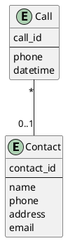
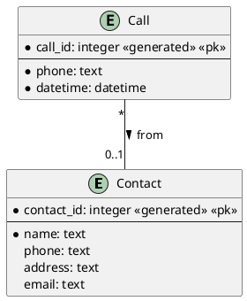
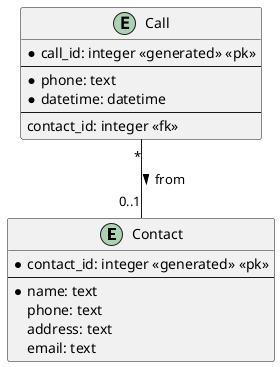
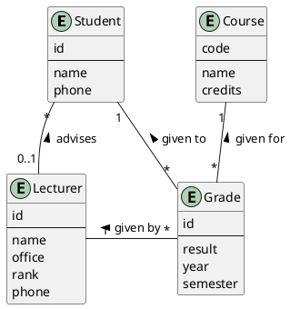
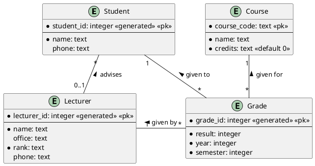
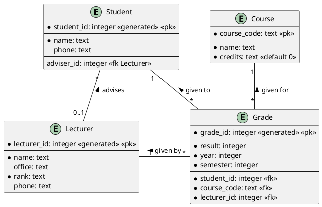

# More on diagrams

- There are different types of ERDs:
    - **conceptual**
    - **logical**
    - **physical**
- *Conceptual* and *logical* models don't have foreign keys in them. There
  are relationships, that will end up being converted to foreign keys, and maybe
  tables, at a later stage, usually in the physical models.
- *Conceptual* models are very basic, without data types and constraints.
- Data types and constraints are usually added to the *logical* models.
- Relationships are translated to tables and foreign keys in the *physical*
  models. The diagrams produced by Datagrip can be considered *physical* models,
  reversed-engineered from an existing database.

## PlantUML ERD examples

### Contact Database

#### Basic diagram (Conceptual)

### With data types and constraints (Logical)

The circle before a column name means **mandatory**, and the absence of such a circle means **optional**.

### With Foreign Keys (Physical)

## College Database

### Conceptual

### Logical

### Physical

