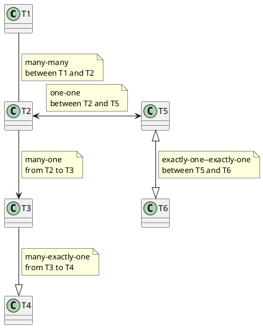
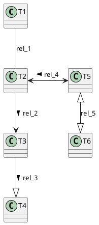
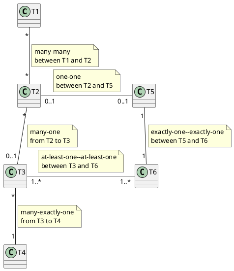
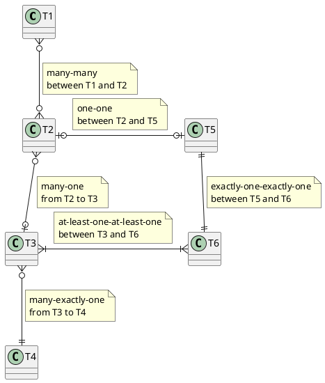

## Traditional Entity-Relationship Diagram Notation for arrow heads

**Note**: cannot easily include diamonds for relationships with PlantUML, but we
can name the relationships with a label. Labels are not used in the first
diagram because of the note boxes close to the relationships. The second diagram
shows relationship labels instead of note boxes.

We usually include note boxes only in some cases, not on all relationships. It
is often recommend to label the relationships to clarify their purpose or
meaning, not only using the traditional ERD notation, but also with the other
notations.

### Diagram without labels

### Diagram with labels

We can include < or > in the labels to help read the relationship more easily.
It's not very useful in this generic example, but it will be useful in the
specific examples.

## Using cardinalities (or multiplicities) instead

**Notes**:

- `*` may be replaced by `n`, or sometimes `m`.
- This is the preferred notation, with labels added on the relationships as
  needed.

## Crow-foot notation

