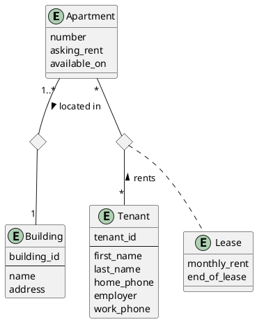
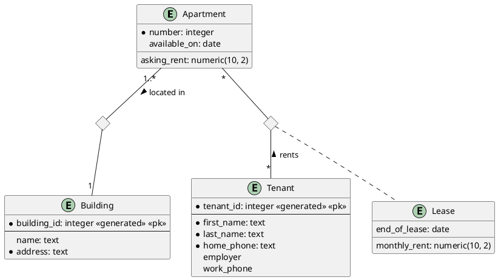
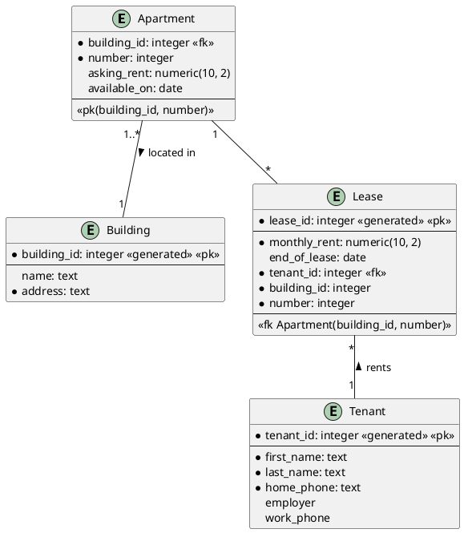

# Apartments for Rent

- You have to design a database to manage the information of a company managing
  a set of apartments for rent.
    - This company manages many buildings, each consisting of at least one
      apartment.
    - Suppose that an apartment can be uniquely identified by its number within
      its building.
    - For each apartment, there is at least one tenant, if it is rented.
    - The monthly rent and the end-of-lease date (if known) must be included.
    - For each apartment available soon, the date of availability and the asking monthly rent must be included.
    - For each tenant, the first name, last name, the home phone number, the
      name of his/her employer and his/her work phone number must be included.

- The date of availability is not always the day after the end of the previous
  lease because an apartment could be
  unavailable for some time because of renovations, for example.
- Following a similar reasoning, the asking monthly rent is not necessarily the
  same as the current rent.

# Conceptual Diagram

# Logical Diagram

# Physical Diagram

