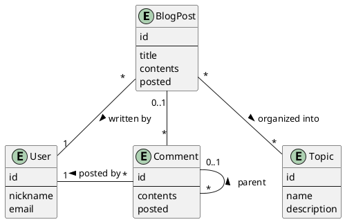
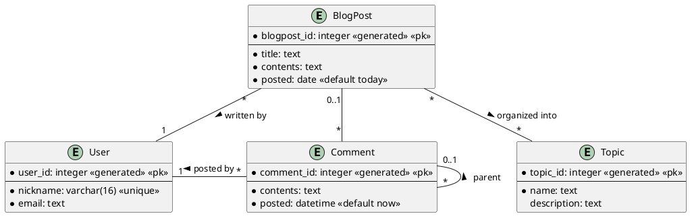
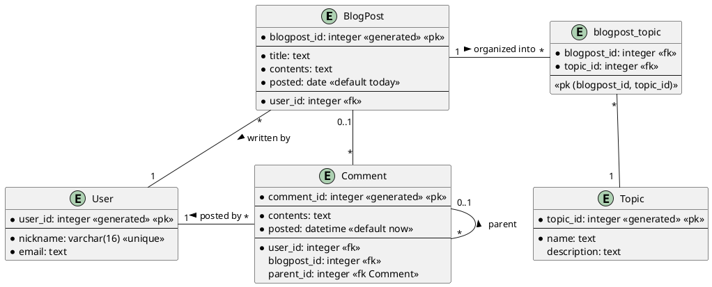

## Exercise #1: Blog

Create an ER diagram for the database of a Blog application, based on the information given below.

### Part 1

1. A blog post should be written by a user.
2. A blog post should have an ID, a title, contents, and a posted date.
3. A user should have a nick name (unique among all the users) and an email address.
4. Blog posts should be organized into topics. There can be many topics per blog post.
5. A topic should have an ID, a name, and a description.

### Part 2

Add the following to the ER diagram you got in the previous part.

1. Users can leave comments on blog posts, and reply to other comments.
2. A comment must be posted by a user (no anonymous comments allowed), and must
   be associated to a blog post or another comment (the parent comment).
3. A comment must have an ID, contents (the comment's text), and a date.

## Conceptual diagram

## Logical diagram

## Physical diagram

