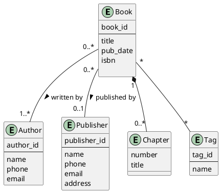
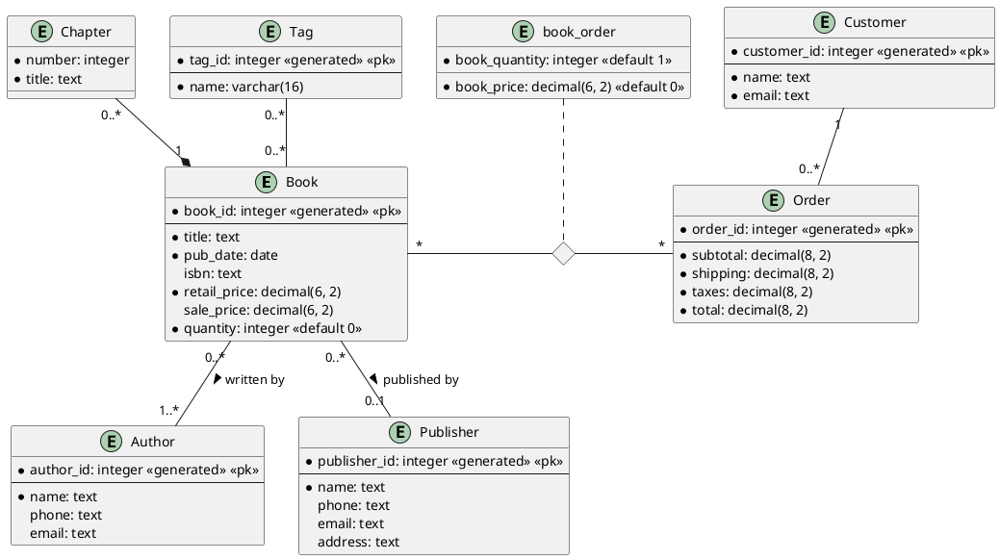
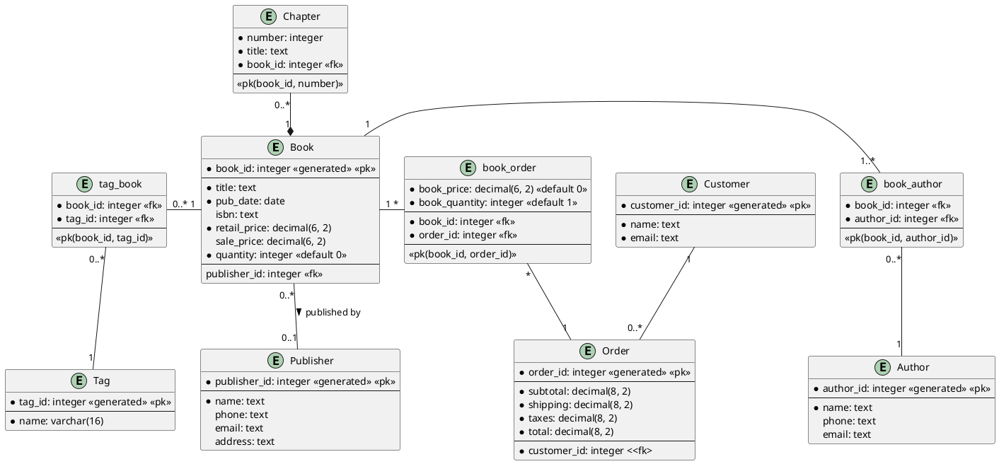

## Exercise #2: Books

Create an ER diagram for a Books database, based on the information given below.

### Part 1

1. A book has a title, a publication date and an ISBN number, and is written by
   one or more authors.
2. An author as a name, a phone number, and an email address.
3. A book can be self-published, or published by a publisher.
4. A publisher has a name, a phone number, an email address and a mailing
   address.

### Part 2

Add the following to the ER diagram you got in the previous part.

1. A book can have many chapters. Each chapter has a number and a title.
2. Tags can be applied to books, such as *fiction* or *non-fiction*,
   *computer science*, *statistics*, *language*, ...

### Part 3

Add the following to the ER diagram you got in the previous part.

1. A bookstore wants to sell books to customers. The books should have a retail
   price, and a sale price.
2. Customers should have a name and an email address.
3. A customer can order many books in the same order. The order should
   record the price of each book ordered, in case the book prices change
   over time.
4. Each order should have the total price (before tax and shipping), the
   shipping cost, and the grand total with shipping and taxes.

## Conceptual Diagram

## Logical Diagram

## Physical Diagram

