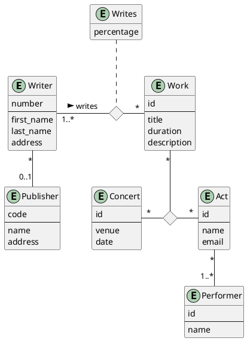
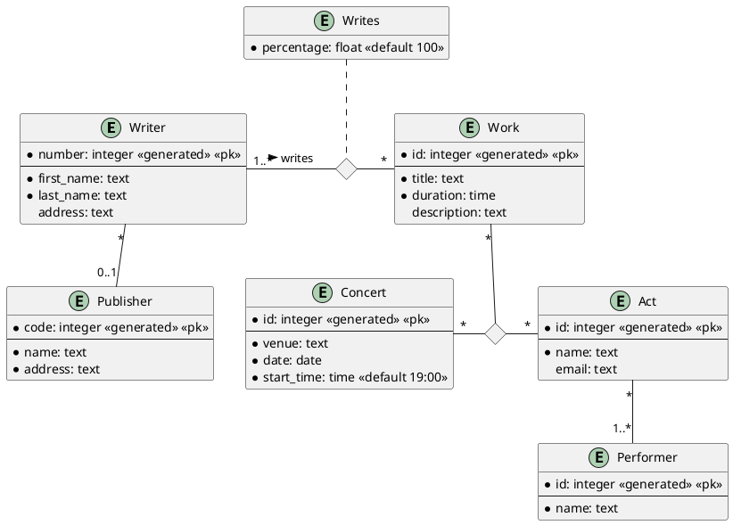
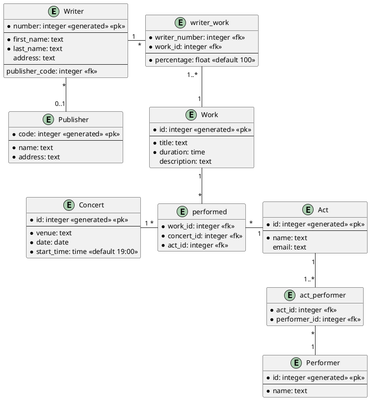

# Music Copyrights Database

- You are asked to design a music copyright collection agency database,
  including information as follows:
    1. A writer has a writer number, first name, last name and address.
    2. Writers may be signed with a publisher. Publishers sign up many writers.
    3. Publishers have a publisher code, name and address.
    4. Writers write works. Works may have more than one writer. Each writer writes a percentage of a work.
    5. A work has a title, duration and description.
    6. Works get performed at concerts (or music shows) by an act.

# Conceptual Diagram

# Logical Diagram

# Physical Diagram

