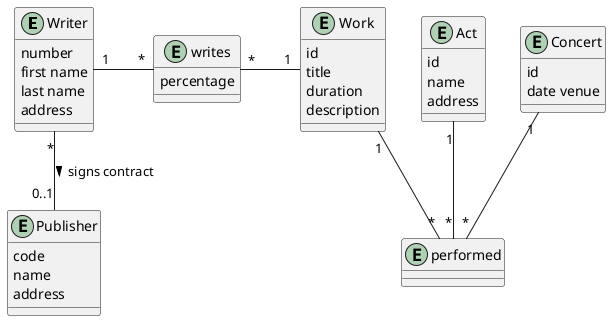
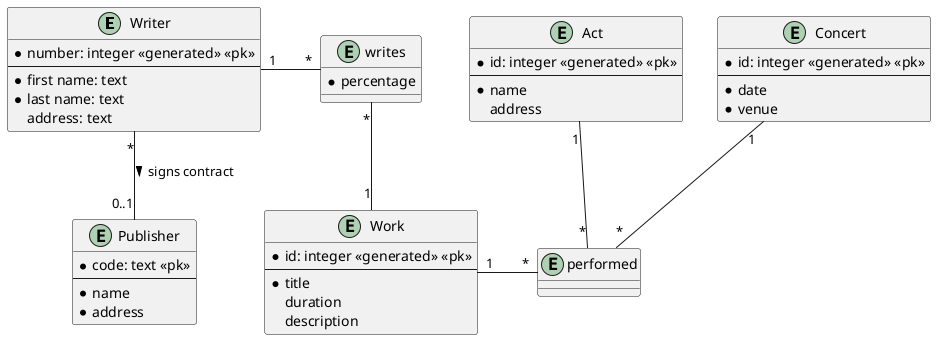
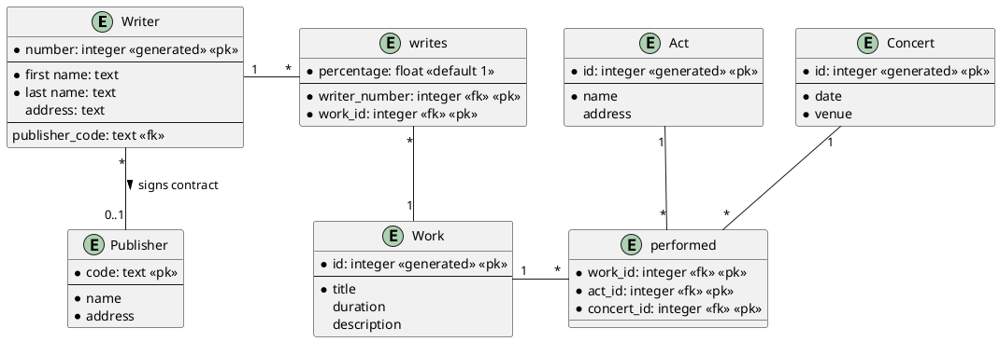

# Music Database

## Conceptual diagram

```plantuml
@startuml

entity Writer {
number
first name
last name
address
}

entity Work {
id
title
duration
description
}

entity Publisher {
code
name
address
}

entity Act {
id
name
address
}

entity Concert {
id
date venue
}

Writer "*" -- "0..1" Publisher: > signs contract

entity writes {
percentage
}
Writer "1" - "*" writes: "       "
writes "*" - "1" Work: "       "

entity performed {

}
Work "1" -- "*" performed
Act "1" -- "*" performed
Concert "1" -- "*" performed
@enduml
```

## Logical diagram

```plantuml
@startuml

entity Writer {
* number: integer <<generated>> <<pk>>
--
* first name: text
* last name: text
  address: text
}

entity Work {
* id: integer <<generated>> <<pk>>
--
* title
  duration
  description
}

entity Publisher {
* code: text <<pk>>
--
* name
* address
}

entity Act {
* id: integer <<generated>> <<pk>>
--
* name
address
}

entity Concert {
* id: integer <<generated>> <<pk>>
--
* date
* venue
}

Writer "*" -- "0..1" Publisher: > signs contract

entity writes {
* percentage
}
Writer "1" - "*" writes: "       "
writes "*" -- "1" Work: "       "

entity performed {

}
Work "1" - "*" performed: "       "
Act "1" -- "*" performed
Concert "1" -- "*" performed
@enduml
```

## Physical diagram

```plantuml
@startuml

entity Writer {
* number: integer <<generated>> <<pk>>
--
* first name: text
* last name: text
  address: text
--
  publisher_code: text <<fk>>
}

entity Work {
* id: integer <<generated>> <<pk>>
--
* title
  duration
  description
}

entity Publisher {
* code: text <<pk>>
--
* name
* address
}

entity Act {
* id: integer <<generated>> <<pk>>
--
* name
address
}

entity Concert {
* id: integer <<generated>> <<pk>>
--
* date
* venue
}

Writer "*" -- "0..1" Publisher: > signs contract

entity writes {
* percentage: float <<default 1>>
--
* writer_number: integer <<fk>> <<pk>>
* work_id: integer <<fk>> <<pk>>
}
Writer "1" - "*" writes: "       "
writes "*" -- "1" Work: "       "

entity performed {
* work_id: integer <<fk>> <<pk>>
* act_id: integer <<fk>> <<pk>>
* concert_id: integer <<fk>> <<pk>>
}
Work "1" - "*" performed: "       "
Act "1" -- "*" performed
Concert "1" -- "*" performed

@enduml
```

