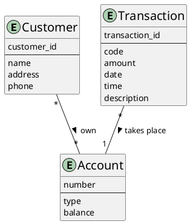
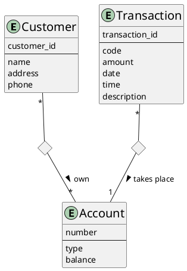
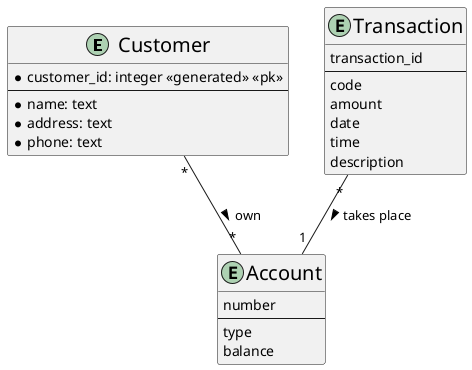

# Simple Bank Database

- The database application called BANK, which keeps track of a Bank’s customers and their accounts.
    - Customers are identified by their name, address, phone and customer ID.
    - Accounts have numbers, types (e.g., savings, checking) and balances.
    - Also record the customer(s) who own an account.
    - A transaction takes place on exactly one account.
    - Each transaction has an ID, a code, an amount, a date, a time and a description.

## Conceptual Model

## Logical Model

