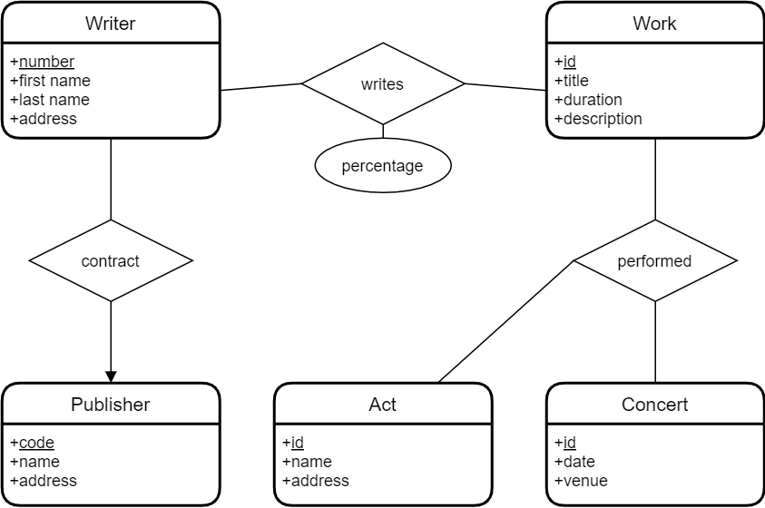

# ER to Relational

## Converting an ER Diagram to a Relational Schema

### Relational Schema

- **Relational schema (relational data model)**: set of table schemas
- **Table schema**:
    - *basic form*: table name and set of column names
        - `employee(emp_id, name, address, dept_id)`

- **Table schema**:
    - *detailed form*: table name and set of column names plus data types and primary keys, and sometimes other
      constraints such as `NOT NULL`
        - columns part of the primary key are either underlined or capitalized
            - to avoid issues with some DBMS, write table and column names with lowercase characters only in
              the `CREATE TABLE` statements
        - columns part of a foreign key are followed by a *
        - *example*: `employee(EMP_ID integer, name text, address text, dept_id* integer)`
    - other forms in between the previous 2 are also possible

### Steps

1. Every entity in the ER diagram will be a table in the relational schema
    - all attributes of the entity become columns in the table schema
    - primary key attributes become primary key columns in the table schema

2. Every many-many relationship will be a table
    - attributes of the relationship are added to the table schema
    - add a foreign key column (or columns) for each table involved in the relationship
    - choose a primary key from the current columns, or add a new primary key columns (such as an ID column)

**Advice**: count the number of entities in the ER diagram, add the number of many-many relationships to it, and this
number will be the number of tables in the relational schema

3. Many-one relationships will **NOT** become tables
    - instead, add a foreign key column on the many side referencing the primary on the one side
    - if the one side is actually *exactly one*, then make the foreign key column `NOT NULL`

4. One-one relationships will **NOT** become tables
    - treat the one-one relationaships similarly to many-one relationships, except that you bring only one of the
      primary keys as a foreign key on the other side
    - there's no perfect rule about which side to choose, it depends on the context
    - if it is an exactly-one-at-most-one relationship, then usually the foreign key will be on the at-most-one side (
      pointing to the exactly-one side)

### Examples

#### Contacts

- `contact(CONTACT_ID, name, phone, address, email)`
- `call(CALL_ID, phone, date, time, contact_id*)`

#### Simple Bank

- `customer(ID, name, address, phone)`
- `account(NUMBER, type, balance)`
- `transaction(ID, code, amount, date, time, description, account_number*)`
- `customer_account(id*, number*)`

#### College (grade relationship)

- `Student(STUDENT_ID, name, phone, advisor_id*)`
- `Lecturer(LECTURER_ID, name, office, rank, phone)`
- `Course(CODE, name, credits)`
- `Grade(GRADE_ID, student_id*, lecturer_id*, course_code*, semester, year, result)`

#### College (grade entity)

- `Student(STUDENT_ID, name, phone, advisor_id*)`
- `Lecturer(LECTURER_ID, name, office, rank, phone)`
- `Course(CODE, name, credits)`
- `Grade(GRADE_ID, student_id* NOT NULL, lecturer_id* NOT NULL, course_code* NOT NULL, semester, year, result)`

#### Music

- `writer(WRITER_ID, first_name, last_name, address, pub_id*)`
- `work(WORK_ID, title, duration, description)`
- `publisher(PUB_ID, code, name, address)`
- `act(ACT_ID, name, address)`
- `concert(CONCERT_ID, date, venue)`
- `writer_work(WRITER_ID*, WORK_ID*, percentage)`
- `performance(PERFORMANCE_ID, act_id*, concert_id*, work_id*)`

#### Appartments

- `building(BUILDING_ID, name, address, managed)`
- `apartment(BUILDING_ID*, NUMBER, date_available, asking_rent, managed)`
- `tenant(TENANT_ID, first_name, last_name, employer, work_phone)`
- `lease(LEASE_ID, building_id*, apartment_number*, rent, end_of_lease)`
- `tenant_lease(tenant_id*, lease_id*)`
