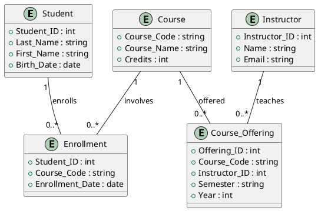

# Introduction to Entity-Relationship Diagrams

An entity-relationship (ER) diagram is a graphical tool used to model data and relationships between them in an
information system. It is commonly used in database design to represent entities, their attributes, and the
relationships between these entities. This type of diagram helps visualize the database structure and understand how
data is interconnected.

## Components of an Entity-Relationship Diagram

1. **Entities**: Represented by rectangles, entities are real-world objects or concepts with independent existence. For
   example, in a university database, entities might be Student, Course, and Instructor.

2. **Attributes**: Represented by ovals, attributes are properties or characteristics of entities. For example, a
   Student may have attributes such as Student_ID, Name, and Birth_Date.

3. **Relationships**: Represented by diamonds, relationships describe how entities are linked to each other. For
   example, an Enrollment relationship may connect the Student and Course entities.

4. **Cardinality**: Cardinality specifies the number of occurrences of one entity that can be associated with an
   occurrence of another entity. Common cardinality types are:
    - One to One (1:1)
    - One to Many (1:N)
    - Many to Many (M:N)

## Example of an Entity-Relationship Diagram

Here is an example of an ER diagram for a university database, in PlantUML format.

![ER University Diagram](https://www.plantuml.com/plantuml/png/XP11JWCn34NtEKKqIr0hs7PLD6NHJK7Y0ACeyLIM9WvAd0L2782Zz1npCQ96esGe2jdbsVxVt_l0odEqam1Yv0yvVtCqg8Zbfv3ftHyFGs4xYSIPdvnDty0UwPp9gvylT4CFYc4uAGn1aOPKD0c8Bx4OzYxwi9Zrpi2GIQMItVxaVV8qo25lLiaUARL5pH1zbQIYxIpFLk5Ks4fNUtndTDIuK3DCFaabT7kKbt7qosnnkTB_7PfHty12Ai2lWIUY-GBbYYLGzzZ9pKPs3zljNIVNM-FrnoAlqEhKZZ>PlantUML
Code

### Diagram Explanation

- **Student**: Entity representing a student, with attributes such as Student_ID, Last_Name, First_Name, and Birth_Date.
- **Course**: Entity representing a course, with attributes such as Course_Code, Course_Name, and Credits.
- **Instructor**: Entity representing an instructor, with attributes such as Instructor_ID, Name, and Email.
- **Enrollment**: Relationship between Student and Course, with attributes such as Student_ID, Course_Code, and
  Enrollment_Date.
- **Course_Offering**: Relationship between Course and Instructor, with attributes such as Offering_ID, Course_Code,
  Instructor_ID, Semester, and Year.

## Conclusion

Entity-relationship diagrams are valuable tools for database modeling. They allow visual representation of entities,
their attributes, and the relationships between them, facilitating understanding and design of the database structure.
Using tools like PlantUML to create these diagrams can help standardize and automate the modeling process.

??? note "References"
    [1] https://www.lucidchart.com/pages/er-diagrams
    [2] https://www.visual-paradigm.com/guide/data-modeling/what-is-entity-relationship-diagram/
    [3] https://en.wikipedia.org/wiki/Entity%E2%80%93relationship_model
    [4] https://opentextbc.ca/dbdesign01/chapter/chapter-8-entity-relationship-model/
    [5] https://www.secoda.co/glossary/entity-relationship-diagram
    [6] https://www.ibm.com/think/topics/entity-relationship-diagram
    [7] https://mermaid.js.org/syntax/entityRelationshipDiagram.html
    [8] https://www.techtarget.com/searchdatamanagement/definition/entity-relationship-diagram-ERD
    [9] https://www.smartdraw.com/entity-relationship-diagram/
    [10] https://www.lucidchart.com/pages/ER-diagram-symbols-and-meaning
    [11] https://fr.wikipedia.org/wiki/Mod%C3%A8le_entit%C3%A9-association

---------------

??? info "Use of AI"
    Page written in part with the help of an AI assistant, mainly using Perplexity AI. The AI was used to generate
    explanations, examples and/or structure suggestions. All information has been verified, edited and completed by the
    author.
