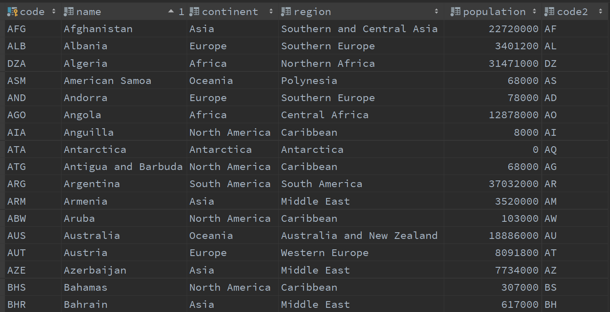
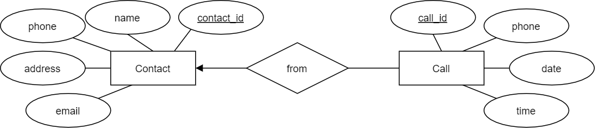
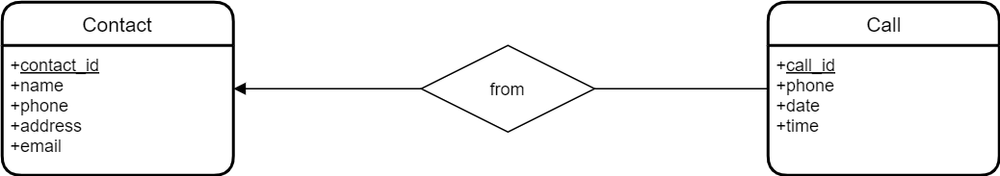

# Modélisation Entité-Association

- *Modèle de données relationnel* (ou *modèle relationnel*)
- *Modèle Entité-Association* (ou *Modèle EA*)
- Exemples

## Modèle Relationnel

- **Relation (table)** : table à deux dimensions, ensemble (et non liste) de
  tuples
- **Attributs** : colonnes de la table, champs
- **Schéma** : `Movies(title, year, length, filmType)`
- **Tuples** : lignes dans la table, enregistrements
- **Domaines** : types

### Exemple de Table (Base de Données `Monde`)

#### Table : **country** (données d'exemple, triées par nom de pays)

### Terminologie

- **Entité** : Quelque chose d'intérêt pour la communauté des utilisateurs de la
  base de données.
    - clients, pièces, localisations géographiques
- **Colonne** : Un élément de données individuel stocké dans une table.
- **Ligne** : Un ensemble de colonnes qui, ensemble, décrivent complètement une
  entité ou une action sur une entité. Aussi appelé un enregistrement.
- **Table** : Un ensemble de lignes, conservées soit en mémoire (non
  persistante) soit sur un stockage permanent (persistant).
- **Ensemble de résultats** : Un autre nom pour une table non persistante,
  généralement le résultat d'une requête SQL.
- **Clé primaire** : Une ou plusieurs colonnes pouvant être utilisées comme
  identifiant unique pour chaque ligne d'une table.
- **Clé étrangère** : Une ou plusieurs colonnes pouvant être utilisées ensemble
  pour identifier une ligne unique dans une autre table.

## Étapes pour créer une nouvelle base de données

1. **Modèles Conceptuels** et **Logiques** : modéliser (ou concevoir) la base de
   données au niveau *conceptuel* et *logique*
    - nous pouvons utiliser la notation traditionnelle **ERD**, ou
    - la notation **UML**, ou
    - d'autres notations [notation.md](02-notation.md)
    - le modèle *conceptuel* est très général, comme une première ébauche, se
      concentrant uniquement sur les entités et les associations
    - le modèle *logique* ajoute des types de données et des contraintes au
      modèle *conceptuel*

2. **Modèle de Données Relationnel**, aussi appelé **Modèle Physique** :
   convertir le modèle logique en modèle de données relationnel
    - nous pourrions utiliser d'autres modèles de données, tels que le modèle
      *objet-relationnel* ou d'autres modèles non relationnels (OO, NoSQL, ...)
    - le modèle relationnel est le modèle le plus courant, et il ne peut pas
      être ignoré lors de l'apprentissage des bases de données

3. **Création d'Instance de Base de Données** : générer les instructions SQL
   nécessaires `CREATE TABLE` et autres pour créer une instance de base de
   données, et la remplir avec des données

- Une fois la base de données créée, vous pouvez commencer à l'utiliser (
  instructions `SELECT`, mises à jour de données, ...)

### Modèle Entité-Association (EA)

#### Notation Traditionnelle

- **Ensembles d'entités** : rectangles
- **Ensembles de associations** : losanges
- **Attributs** : ovales
- **Flèches** pour connecter les ensembles de associations aux ensembles
  d'entités :
    - *triangle noir plein* : au plus 1
    - *triangle rond ouvert* ou *triangle transparent* : exactement 1
    - pas de flèches : plusieurs
- **Clés primaires** : noms d'attributs soulignés

#### Notation UML

[notation.md](02-notation.md)

- **Entités** : rectangles
- **Associations** : lignes entre les entités, éventuellement avec des étiquettes
  et des flèches directionnelles à côté des étiquettes
- **Attributs** : dans les rectangles des entités, sous les noms des entités
- **Cardinalités** pour connecter les associations aux entités :
    - *au plus 1* : `0..1`
    - *exactement 1* : `1` ou `1..1`
    - *plusieurs* : `*`
    - *au moins 1* : `1..*`
- **Clés primaires** : attributs avec la contrainte `<<pk>>`
- **Clés étrangères** (dans les diagrammes physiques uniquement) : attributs
  avec la contrainte `<<fk>>`
- **Contrainte de non-nullité** : cercle avant le nom de l'attribut

#### Base de Données de Contacts

#### Notation Traditionnelle

#### Autre Notation Traditionnelle

#### Notation UML

