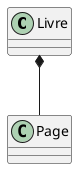
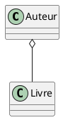

# Les Entités Faibles

## Définition

Dans le modèle entité-association (E-A), une **entité faible** est une entité
qui ne peut pas être identifiée de manière unique par ses propres attributs
seuls. Elle dépend d'une autre entité, appelée **entité forte**, pour son
identification. Une entité faible est souvent utilisée pour représenter des
objets qui n'ont pas de signification indépendante sans leur entité forte
associée.

## Caractéristiques des Entités Faibles

1. **Dépendance d'Existence** : Une entité faible ne peut pas exister sans son
   entité forte correspondante.
2. **Clé Partielle** : L'identification d'une entité faible nécessite une clé
   partielle (un ensemble d'attributs propres à l'entité faible) en combinaison
   avec la clé primaire de l'entité forte.
3. **Relation d'Identification** : Une relation spéciale, souvent appelée
   relation d'identification, relie l'entité faible à son entité forte.

## Exemple

Considérons une base de données pour une bibliothèque. Nous avons deux entités :
**Bibliothèque** et **Livre**.

- **Bibliothèque** (entité forte) : Identifiée par un attribut unique,
  comme `ID_Bibliothèque`.
- **Livre** (entité faible) : Identifié par une combinaison de `ID_Bibliothèque`
  et `Numéro_Livre`. Un livre n'a pas de signification sans la bibliothèque à
  laquelle il appartient.

## Comparaison avec la Conception Orientée Objet (OO) en UML

En conception orientée objet avec UML (Unified Modeling Language), les concepts
d'entités faibles et fortes peuvent être comparés aux relations de composition
et d'agrégation.

- **Composition** : Similaire aux entités faibles, une classe composante ne peut
  pas exister indépendamment de la classe composite. Par exemple, une
  classe `Page` peut être une composante d'une classe `Livre`, et une page n'a
  pas de sens sans le livre auquel elle appartient.
- **Agrégation** : Contrairement aux entités faibles, une classe agrégée peut
  exister indépendamment de la classe agrégante. Par exemple, une
  classe `Auteur` peut être associée à plusieurs `Livres`, mais elle peut
  exister indépendamment de ces livres.

## Illustration UML

En UML, une composition est représentée par un losange rempli à l'extrémité de
l'association, tandis qu'une agrégation est représentée par un losange vide.

- **Composition** :

    
Code

- **Agrégation** :

    
Code

## Conclusion

Les entités faibles sont un concept crucial dans le modèle entité-association
pour modéliser des objets dépendants d'autres objets pour leur identification.
En comparaison, la conception orientée objet utilise des relations de
composition pour représenter des dépendances similaires, mais permet également
des relations plus lâches avec l'agrégation. Comprendre ces concepts est
essentiel pour concevoir des bases de données relationnelles robustes et bien
structurées.

-------
<small>
   <cite>
      **Note** : Page rédigée en partie avec l'aide d'un assistant IA, principalement
      à l'aide de Perplexity AI, avec les LLM `GPT-4 Omni` et `Claude 3.5 Sonnet`. L'IA
      a été utilisée pour générer des explications, des exemples et/ou des suggestions de
      structure. Toutes les informations ont été vérifiées, éditées et complétées par
      l'auteur.
   </cite>
</small>