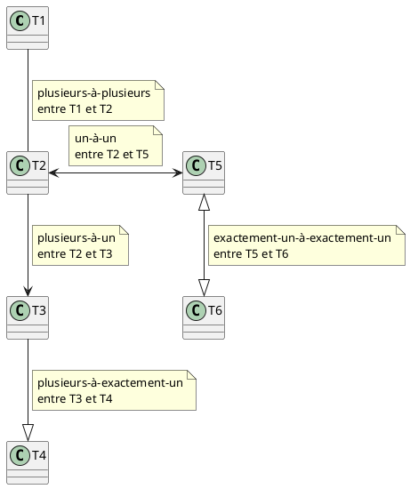
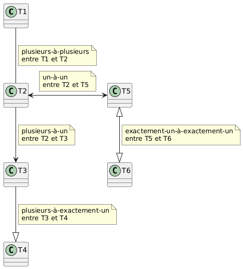
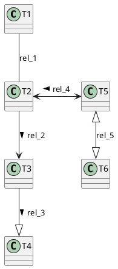
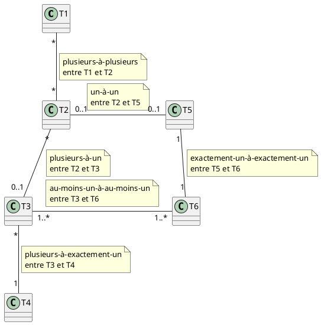
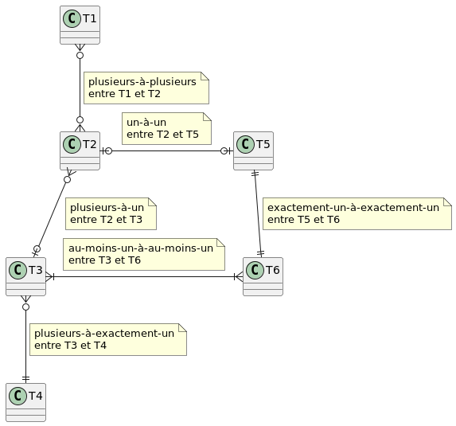
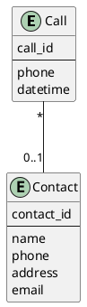
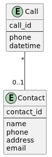
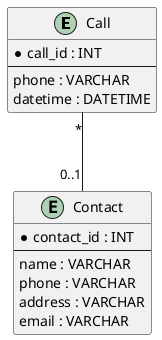
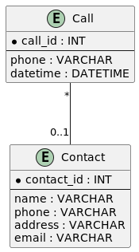

# Différentes notations pour les DEA

## Notation traditionnelle du diagramme entité-association

**Remarque** : il est difficile d'inclure des losanges pour les associations
avec PlantUML, mais nous pouvons nommer les associations avec une étiquette. Les
étiquettes ne sont pas utilisées dans le premier diagramme en raison des boîtes
de notes proches des associations. Le deuxième diagramme montre les étiquettes
des associations au lieu des boîtes de notes.

Nous incluons généralement des boîtes de notes uniquement dans certains cas, pas
sur toutes les associations. Il est souvent recommandé de nommer les
associations pour clarifier leur objectif ou leur signification, non seulement
en utilisant la notation traditionnelle ERD, mais aussi avec d'autres notations.

### Diagramme avec étiquettes

	
Code

### Diagramme sans étiquettes

Nous pouvons inclure `<` ou `>` dans les étiquettes pour aider à lire
l'association plus facilement. Ce n'est pas très utile dans cet exemple
générique, mais ce sera utile dans les exemples spécifiques.

    
Code

## Utilisation des cardinalités (ou multiplicités) à la place

**Remarques** :

- `*` peut être remplacé par `n`, ou parfois `m`.

- C'est la notation préférée, avec des étiquettes ajoutées sur les associations
  si nécessaire.

    
Code

## Notation en pied-de-corbeau

    
Code

## Différents types de diagrammes EA avec PlantUML

- Il existe différents types de DEA :
    - **conceptuel**
    - **logique**
    - **physique**
- Les modèles *conceptuels* et *logiques* ne contiennent pas de clés étrangères.
  Il y a des associations, qui seront éventuellement converties en clés
  étrangères, et peut-être en tables, à une étape ultérieure, généralement dans
  les modèles physiques.
- Les modèles *conceptuels* sont très basiques, sans types de données ni
  contraintes.
- Les types de données et les contraintes sont généralement ajoutés aux modèles
  *logiques*.
- Les associations sont traduites en tables et en clés étrangères dans les
  modèles *physiques*. Les diagrammes produits par Datagrip peuvent être
  considérés comme des modèles *physiques*, rétro-conçus à partir d'une base de
  données existante.

### Base de données de contacts

#### Diagramme de base (Conceptuel)

    
Code

### Avec types de données et contraintes (Logique)

Le cercle avant un nom de colonne signifie **obligatoire**, et l'absence de ce
cercle signifie **optionnel**.

    
Code

