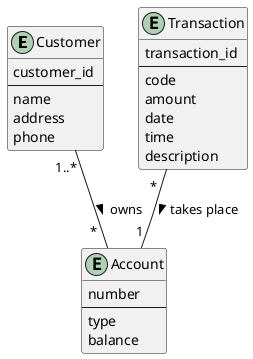
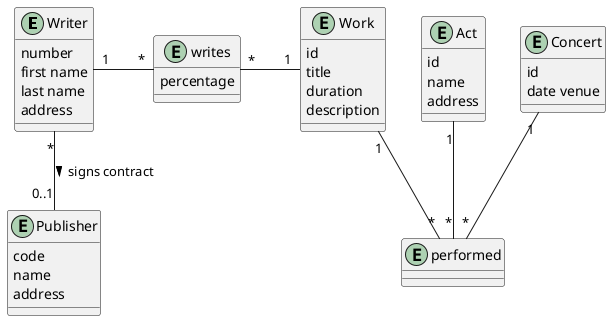
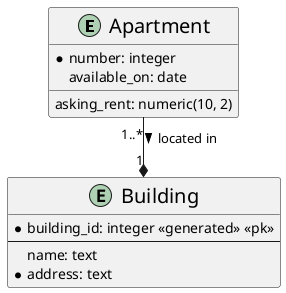

# Exemples

## Base de Données Bancaire Simple

- L'application de base de données appelée BANK, qui suit les clients d'une
  banque et leurs comptes.
    - Les clients sont identifiés par leur nom, adresse, téléphone et ID client.
    - Les comptes ont des numéros, des types (par exemple, épargne, courant) et
      des soldes.
    - Enregistrer également le(s) client(s) qui possèdent un compte.
    - Une transaction a lieu sur un seul compte.
    - Chaque transaction a un ID, un code, un montant, une date, une heure et
      une description.

    
Traditionnelle

    

    
UML

    

    
Code

 

## Base de Données d'un Collège

- Dans cette base de données, vous devez enregistrer les étudiants, les
  enseignants, les cours, les notes et les conseillers étudiants.
    - Chaque étudiant a un numéro d'étudiant, un nom et une adresse.
    - Chaque enseignant a un numéro d'employé, un nom, un numéro de bureau, un
      rang et un numéro de téléphone.
    - Pour chaque cours, son code, son nom et son nombre de crédits sont
      enregistrés.
    - Une note est donnée à un étudiant par un enseignant pour un cours enseigné
      pendant un semestre (A, B ou C) d'une année particulière.
    - Les conseillers des étudiants sont des enseignants.

    
Traditionnelle (avec association <em>grade</em>) 

    

    
Traditionnelle (avec entité <em>grade</em>) 

    

    
UML

    

 

## Base de Données des Droits d'Auteur de Musique

- Vous êtes chargé de concevoir une base de données pour une agence de collecte
  de droits d'auteur de musique, incluant les informations suivantes :
    - Un auteur a un numéro d'auteur, un prénom, un nom de famille et une
      adresse.
    - Les auteurs peuvent être signés avec un éditeur. Les éditeurs signent de
      nombreux auteurs.
    - Les éditeurs ont un code éditeur, un nom et une adresse.
    - Les auteurs écrivent des œuvres. Les œuvres peuvent avoir plus d'un
      auteur. Chaque auteur écrit un pourcentage d'une œuvre.
    - Une œuvre a un titre, une durée et une description.
    - Les œuvres sont interprétées lors de concerts (ou spectacles de musique)
      par un groupe.
    - Un concert a une date et un lieu.

    
Traditionnelle

    

    
UML

    

    
Code

 

## Appartements à Louer

- Vous devez concevoir une base de données pour gérer les informations d'une
  entreprise gérant un ensemble d'appartements à louer.
    - Cette entreprise gère de nombreux bâtiments, chacun composé d'au moins un
      appartement.
    - Supposons qu'un appartement puisse être identifié de manière unique par
      son numéro dans son bâtiment.
    - Pour chaque appartement, il y a au moins un locataire, s'il est loué.
    - Le loyer mensuel et la date de fin de bail (si connue) doivent être
      inclus.
    - Pour chaque appartement disponible prochainement, la date de disponibilité
      et le loyer mensuel demandé doivent être inclus.
    - Pour chaque locataire, le prénom, le nom de famille, le numéro de
      téléphone à domicile, le nom de son employeur et son numéro de téléphone
      professionnel doivent être inclus.

- Cette date de fin de bail n'est pas toujours le jour suivant la fin du bail
  précédent car un appartement pourrait être indisponible pendant un certain
  temps en raison de rénovations, par exemple.
- En suivant un raisonnement similaire, le loyer mensuel demandé n'est pas
  nécessairement le même que le loyer actuel.

### Entité Faible : Appartement

#### Notation Traditionnelle

    
Traditionnelle 1

    

    
Traditionnelle 2

    

    
UML

    

    
Code

 

### Appartements à Louer

#### Diagramme Complet

    
Traditionnelle

    

    
UML

    

 

#### Diagramme Amélioré

    
Traditionnelle

    

    
UML

    

 
