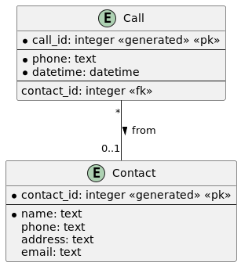
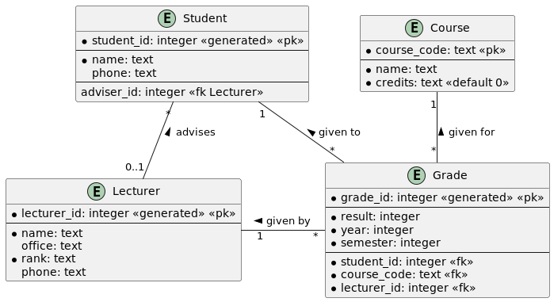

# Conversion d'un diagramme EA en schéma relationnel

## Schéma relationnel

- **Schéma relationnel (modèle de données relationnel)** : ensemble de schémas
  de tables
- **Schéma de table** :
    - *forme basique* : nom de la table et ensemble de noms de colonnes
        - `employee(emp_id, name, address, dept_id)`

- **Schéma de table** :
    - *forme détaillée* : nom de la table et ensemble de noms de colonnes plus
      types de données et clés primaires, et parfois d'autres contraintes telles
      que `NOT NULL`
        - les colonnes faisant partie de la clé primaire sont soit soulignées,
          soit en majuscules
            - pour éviter des problèmes avec certains SGBD, écrivez les noms des
              tables et des colonnes uniquement en minuscules dans les
              instructions `CREATE TABLE`
        - les colonnes faisant partie d'une clé étrangère sont suivies d'un *
        -
        *exemple* : `employee(EMP_ID integer, name text, address text, dept_id* integer)`
    - d'autres formes intermédiaires entre les deux précédentes sont également
      possibles
- **Diagramme physique** : à partir d'un diagramme logique, convertir toutes les
  relations en clés étrangères et entités supplémentaires (ou tables) si
  nécessaire

## Étapes

1. Chaque entité du diagramme ER sera une table dans le schéma relationnel
    - tous les attributs de l'entité deviennent des colonnes dans le schéma de
      table
    - les attributs de clé primaire deviennent des colonnes de clé primaire dans
      le schéma de table

2. Chaque association plusieurs-à-plusieurs sera une table
    - les attributs de l'association sont ajoutés au schéma de table
    - ajouter une colonne de clé étrangère (ou des colonnes) pour chaque table
      impliquée dans l'association
    - choisir une clé primaire parmi les colonnes actuelles, ou ajouter de
      nouvelles colonnes de clé primaire (comme une colonne ID)

   **Conseil** : comptez le nombre d'entités dans le diagramme ER, ajoutez le
   nombre d'associations plusieurs-à-plusieurs, et ce nombre sera le nombre de
   tables dans le schéma relationnel

3. Les associations plusieurs-à-un ne deviendront **PAS** des tables
    - à la place, ajoutez une colonne de clé étrangère du côté plusieurs
      référant la clé primaire du côté un
    - si le côté un est en fait *exactement un*, alors rendez la colonne de clé
      étrangère `NOT NULL`

4. Les associations un-à-un ne deviendront **PAS** des tables
    - traitez les associations un-à-un de manière similaire aux associations
      plusieurs-à-un, sauf que vous ne prenez qu'une des clés primaires comme
      clé étrangère de l'autre côté
    - il n'y a pas de règle parfaite sur quel côté choisir, cela dépend du
      contexte
    - si c'est une association exactement-un-à-au-plus-un, alors généralement la
      clé étrangère sera du côté au-plus-un (pointant vers le côté
      exactement-un)

## Exemples

### Contacts

    
Réponse

    <pre>
contact(CONTACT_ID, name, phone, address, email)
call(CALL_ID, phone, date, time, contact_id*)
    </pre>

 

### Simple Bank

    
Réponse

    <pre>
customer(ID, name, address, phone)
account(NUMBER, type, balance)
transaction(ID, code, amount, date, time, description, account_number*)
customer_account(id*, number*)
    </pre>

 

### Collège

    
Réponse

    <pre>
Student(STUDENT_ID, name, phone, advisor_id*)
Lecturer(LECTURER_ID, name, office, rank, phone)
Course(CODE, name, credits)
Grade(GRADE_ID, student_id* NOT NULL, 
      lecturer_id* NOT NULL, 
      course_code* NOT NULL, 
      semester, 
      year, 
      result)
    </pre>

 

### Music

    
Réponse

    <pre>
writer(WRITER_ID, first_name, last_name, address, pub_id*)
work(WORK_ID, title, duration, description)
publisher(PUB_ID, code, name, address)
act(ACT_ID, name, address)
concert(CONCERT_ID, date, venue)
writer_work(WRITER_ID*, WORK_ID*, percentage)
performance(PERFORMANCE_ID, act_id*, concert_id*, work_id*)
    </pre>

 

### Appartments

    
Réponse

    <pre>
building(BUILDING_ID, name, address, managed)
apartment(BUILDING_ID*, NUMBER, date_available, asking_rent, managed)
tenant(TENANT_ID, first_name, last_name, employer, work_phone)
lease(LEASE_ID, building_id*, apartment_number*, rent, end_of_lease)
tenant_lease(tenant_id*, lease_id*)
    </pre>

 