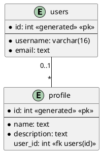
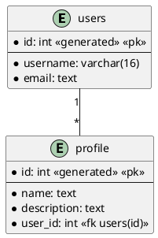
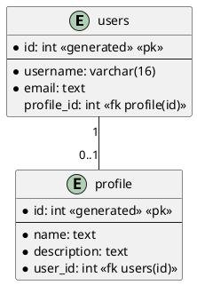
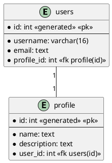

# Transactions

[exemples_fk.sql](../src/exemples_fk.sql)

## Version 1

```sql
create schema exemples_fk1;
set search_path to exemples_fk1;

create table users
(
    id       int generated by default as identity primary key,
    username varchar(16) unique not null,
    email    text unique        not null
);

create table profile
(
    id          int generated by default as identity primary key,
    name        text not null,
    description text not null,
    user_id int references users(id)
);
```



## Version 2



```sql
create schema exemples_fk2;
set search_path to exemples_fk2;

create table users
(
    id       int generated by default as identity primary key,
    username varchar(16) unique not null,
    email    text unique        not null
);

create table profile
(
    id          int generated by default as identity primary key,
    name        text not null,
    description text not null,
    user_id int references users(id) not null 
);
```

## Version 3



```sql
create schema exemples_fk3;
set search_path to exemples_fk3;

-- erreur, profile n'existe pas
-- si on inverse la création des tables, on obtiendra également une erreur, que users n'existe pas
create table users
(
    id         int generated by default as identity primary key,
    username   varchar(16) unique not null,
    email      text unique        not null,
    profile_id int references profile (id)
);

create table profile
(
    id          int generated by default as identity primary key,
    name        text                      not null,
    description text                      not null,
    user_id     int references users (id) not null
);
```

```sql
create schema exemples_fk3;
set search_path to exemples_fk3;

create table users
(
    id         int generated by default as identity primary key,
    username   varchar(16) unique not null,
    email      text unique        not null,
    profile_id int -- references profile (id)
);

create table profile
(
    id          int generated by default as identity primary key,
    name        text                      not null,
    description text                      not null,
    user_id     int references users (id) not null
);

alter table users add foreign key (profile_id) references profile(id);

insert into users(username, email) values ('denis', 'denis@example.com');
insert into profile(name, description, user_id) values ('public', 'profil public', 1); 
update users set profile_id = 1 where id = 1;
```

## Version 4



```sql
create schema exemples_fk4;
set search_path to exemples_fk4;

create table users
(
    id         int generated by default as identity primary key,
    username   varchar(16) unique not null,
    email      text unique        not null,
    profile_id int                not null -- references profile (id)
);

create table profile
(
    id          int generated by default as identity primary key,
    name        text                      not null,
    description text                      not null,
    user_id     int references users (id) not null
);

alter table users
    add foreign key (profile_id) references profile (id);


-- erreur: profile_id ne peut pas être null
insert into users(username, email)
values ('denis', 'denis@example.com');

-- erreur: user_id n'existe pas
insert into profile(name, description, user_id)
values ('public', 'profil public', 1);
```

**Solution** : utiliser une transaction

```sql
create schema exemples_fk5;
set search_path to exemples_fk5;

create table users
(
    id         int generated by default as identity primary key,
    username   varchar(16) unique not null,
    email      text unique        not null,
    profile_id int                not null -- references profile (id)
);

create table profile
(
    id          int generated by default as identity primary key,
    name        text                      not null,
    description text                      not null,
    user_id     int references users (id) not null
);

alter table users
    add constraint user_id_fk foreign key (profile_id) references profile (id) deferrable;
```

### Transaction

```sql
begin transaction;

set constraints user_id_fk deferred ;

insert into users(username, email, profile_id)
values ('denis', 'denis@example.com', 0);

insert into profile(name, description, user_id)
values ('public', 'profil public', 1);

update users set profile_id = 1 where id = 1;

set constraints user_id_fk immediate;

commit;
```

### insert into ... retuning id

```sql
insert into profile(name, description, user_id)
values ('public', 'profil public', 1) returning id;
```