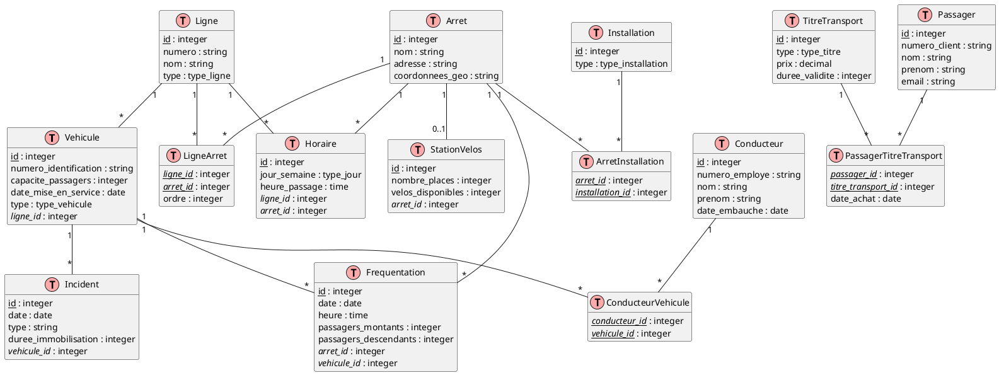

# 3. Réseau de transports en commun

## Modèles logiques

Créez un diagramme EA pour la base de données d'un réseau de transports en commun, basé sur les informations données
ci-dessous.

### Partie 1

1. Le réseau de transports en commun comprend différents types de véhicules : bus, métros et tramways.
2. Chaque véhicule a un numéro d'identification unique, une capacité de passagers et une date de mise en service.
3. Le réseau est composé de plusieurs lignes. Chaque ligne a un numéro, un nom et un type (bus, métro ou tramway).
4. Chaque ligne dessert plusieurs arrêts. Un arrêt a un nom, une adresse et des coordonnées géographiques.
5. Les conducteurs sont affectés aux véhicules. Un conducteur a un numéro d'employé, un nom, un prénom et une date
   d'embauche.

<details>
    <summary>Code</summary>
   
```sql
@startuml
entity Vehicule {
  * numero_identification : string
  --
  capacite_passagers : integer
  date_mise_en_service : date
  type : enum {bus, metro, tramway}
}

entity Ligne {
  * numero : string
  --
  nom : string
  type : enum {bus, metro, tramway}
}

entity Arret {
  * id : integer
  --
  nom : string
  adresse : string
  coordonnees_geo : string
}

entity Conducteur {
  * numero_employe : string
  --
  nom : string
  prenom : string
  date_embauche : date
}

Ligne "*" -- "*" Arret : dessert
Conducteur "*" -- "*" Vehicule : conduit
Ligne "1" -- "*" Vehicule : utilise
@enduml
```
</details>
<br>
<details>
   <summary>Diagramme</summary>
   
</details>
<br>

### Partie 2

Ajoutez les éléments suivants au diagramme EA que vous avez obtenu dans la partie précédente.

1. Chaque ligne a un horaire qui définit les heures de passage à chaque arrêt. Un horaire peut varier selon le jour de
   la semaine (jour ouvré, samedi, dimanche et jours fériés).
2. Les passagers peuvent acheter différents types de titres de transport : ticket unitaire, carnet de 10 tickets,
   abonnement mensuel ou annuel.
3. Chaque titre de transport a un prix et une durée de validité.
4. Les passagers doivent s'enregistrer pour obtenir un abonnement. Un passager a un numéro de client, un nom, un prénom
   et une adresse e-mail.

<details>
    <summary>Code</summary>
   
```sql
@startuml
entity Vehicule {
  * numero_identification : string
  --
  capacite_passagers : integer
  date_mise_en_service : date
  type : enum {bus, metro, tramway}
}

entity Ligne {
  * numero : string
  --
  nom : string
  type : enum {bus, metro, tramway}
}

entity Arret {
  * id : integer
  --
  nom : string
  adresse : string
  coordonnees_geo : string
}

entity Conducteur {
  * numero_employe : string
  --
  nom : string
  prenom : string
  date_embauche : date
}

Ligne "*" -- "*" Arret : dessert
Conducteur "*" -- "*" Vehicule : conduit
Ligne "1" -- "*" Vehicule : utilise

entity Horaire {
  * id : integer
  --
  jour_semaine : enum {ouvre, samedi, dimanche, ferie}
  heure_passage : time
}

entity TitreTransport {
  * id : integer
  --
  type : enum {unitaire, carnet10, mensuel, annuel}
  prix : decimal
  duree_validite : integer
}

entity Passager {
  * numero_client : string
  --
  nom : string
  prenom : string
  email : string
}

Ligne "1" -- "*" Horaire
Arret "1" -- "*" Horaire
Passager "*" -- "*" TitreTransport : achete
@enduml
```
</details>
<br>
<details>
   <summary>Diagramme</summary>
   
</details>
<br>

### Partie 3

Ajoutez les éléments suivants au diagramme EA que vous avez obtenu dans la partie précédente.

1. Le réseau souhaite suivre la fréquentation des lignes. Pour cela, on enregistre le nombre de passagers montant et
   descendant à chaque arrêt, pour chaque trajet.
2. Les véhicules peuvent tomber en panne. On souhaite enregistrer les incidents, avec la date, le type d'incident et la
   durée d'immobilisation du véhicule.
3. Les arrêts peuvent être équipés de différentes installations : abris, bancs, distributeurs de tickets, panneaux
   d'information en temps réel. On veut pouvoir savoir quelles installations sont présentes à chaque arrêt.
4. Le réseau propose un système de vélos en libre-service aux arrêts principaux. Chaque station de vélos a un nombre de
   places de stationnement et un nombre de vélos disponibles qui varie au cours de la journée.

<details>
    <summary>Code</summary>

```sql
@startuml
entity Vehicule {
  * numero_identification : string
  --
  capacite_passagers : integer
  date_mise_en_service : date
  type : enum {bus, metro, tramway}
}

entity Ligne {
  * numero : string
  --
  nom : string
  type : enum {bus, metro, tramway}
}

entity Arret {
  * id : integer
  --
  nom : string
  adresse : string
  coordonnees_geo : string
}

entity Conducteur {
  * numero_employe : string
  --
  nom : string
  prenom : string
  date_embauche : date
}

Ligne "*" -- "*" Arret : dessert
Conducteur "*" -- "*" Vehicule : conduit
Ligne "1" -- "*" Vehicule : utilise

entity Horaire {
  * id : integer
  --
  jour_semaine : enum {ouvre, samedi, dimanche, ferie}
  heure_passage : time
}

entity TitreTransport {
  * id : integer
  --
  type : enum {unitaire, carnet10, mensuel, annuel}
  prix : decimal
  duree_validite : integer
}

entity Passager {
  * numero_client : string
  --
  nom : string
  prenom : string
  email : string
}

Ligne "1" -- "*" Horaire
Arret "1" -- "*" Horaire
Passager "*" -- "*" TitreTransport : achete


entity Frequentation {
  * id : integer
  --
  date : date
  heure : time
  passagers_montants : integer
  passagers_descendants : integer
}

entity Incident {
  * id : integer
  --
  date : date
  type : string
  duree_immobilisation : integer
}

entity Installation {
  * id : integer
  --
  type : enum {abri, banc, distributeur, panneau_info}
}

entity StationVelos {
  * id : integer
  --
  nombre_places : integer
  velos_disponibles : integer
}

Arret "1" -- "*" Frequentation
Vehicule "1" -- "*" Incident
Arret "*" -- "*" Installation : equipee_de
Arret "1" -- "0..1" StationVelos
@enduml
```
</details>
<br>
<details>
   <summary>Diagramme</summary>
   
</details>
<br>

## Modèle physique

<details>
    <summary>Code</summary>
    

</details>
<br>
<details>
   <summary>Diagramme</summary>
   
</details>
<br>

### Création

<details>
    <summary>Code</summary>
    
```sql
-- Création des types enum
CREATE TYPE type_vehicule AS ENUM ('bus', 'metro', 'tramway');
CREATE TYPE type_ligne AS ENUM ('bus', 'metro', 'tramway');
CREATE TYPE type_jour AS ENUM ('ouvre', 'samedi', 'dimanche', 'ferie');
CREATE TYPE type_titre AS ENUM ('unitaire', 'carnet10', 'mensuel', 'annuel');
CREATE TYPE type_installation AS ENUM ('abri', 'banc', 'distributeur', 'panneau_info');

-- Création des tables
CREATE TABLE Ligne (
    id INTEGER GENERATED BY DEFAULT AS IDENTITY PRIMARY KEY,
    numero VARCHAR(20) UNIQUE NOT NULL,
    nom VARCHAR(100) NOT NULL,
    type type_ligne NOT NULL
);

CREATE TABLE Vehicule (
    id INTEGER GENERATED BY DEFAULT AS IDENTITY PRIMARY KEY,
    numero_identification VARCHAR(50) UNIQUE NOT NULL,
    capacite_passagers INTEGER NOT NULL,
    date_mise_en_service DATE NOT NULL,
    type type_vehicule NOT NULL,
    ligne_id INTEGER NOT NULL REFERENCES Ligne(id)
);

CREATE TABLE Arret (
    id INTEGER GENERATED BY DEFAULT AS IDENTITY PRIMARY KEY,
    nom VARCHAR(100) NOT NULL,
    adresse TEXT,
    coordonnees_geo VARCHAR(50)
);

CREATE TABLE LigneArret (
    ligne_id INTEGER REFERENCES Ligne(id),
    arret_id INTEGER REFERENCES Arret(id),
    ordre INTEGER NOT NULL,
    PRIMARY KEY (ligne_id, arret_id)
);

CREATE TABLE Conducteur (
    id INTEGER GENERATED BY DEFAULT AS IDENTITY PRIMARY KEY,
    numero_employe VARCHAR(50) UNIQUE NOT NULL,
    nom VARCHAR(100) NOT NULL,
    prenom VARCHAR(100) NOT NULL,
    date_embauche DATE NOT NULL
);

CREATE TABLE Horaire (
    id INTEGER GENERATED BY DEFAULT AS IDENTITY PRIMARY KEY,
    jour_semaine type_jour NOT NULL,
    heure_passage TIME NOT NULL,
    ligne_id INTEGER NOT NULL REFERENCES Ligne(id),
    arret_id INTEGER NOT NULL REFERENCES Arret(id)
);

CREATE TABLE TitreTransport (
    id INTEGER GENERATED BY DEFAULT AS IDENTITY PRIMARY KEY,
    type type_titre NOT NULL,
    prix DECIMAL(10, 2) NOT NULL,
    duree_validite INTEGER NOT NULL
);

CREATE TABLE Passager (
    id INTEGER GENERATED BY DEFAULT AS IDENTITY PRIMARY KEY,
    numero_client VARCHAR(50) UNIQUE NOT NULL,
    nom VARCHAR(100) NOT NULL,
    prenom VARCHAR(100) NOT NULL,
    email VARCHAR(100) UNIQUE NOT NULL
);

CREATE TABLE Frequentation (
    id INTEGER GENERATED BY DEFAULT AS IDENTITY PRIMARY KEY,
    date DATE NOT NULL,
    heure TIME NOT NULL,
    passagers_montants INTEGER NOT NULL,
    passagers_descendants INTEGER NOT NULL,
    arret_id INTEGER NOT NULL REFERENCES Arret(id),
    vehicule_id INTEGER NOT NULL REFERENCES Vehicule(id)
);

CREATE TABLE Incident (
    id INTEGER GENERATED BY DEFAULT AS IDENTITY PRIMARY KEY,
    date DATE NOT NULL,
    type VARCHAR(100) NOT NULL,
    duree_immobilisation INTEGER NOT NULL,
    vehicule_id INTEGER NOT NULL REFERENCES Vehicule(id)
);

CREATE TABLE Installation (
    id INTEGER GENERATED BY DEFAULT AS IDENTITY PRIMARY KEY,
    type type_installation NOT NULL
);

CREATE TABLE ArretInstallation (
    arret_id INTEGER REFERENCES Arret(id),
    installation_id INTEGER REFERENCES Installation(id),
    PRIMARY KEY (arret_id, installation_id)
);

CREATE TABLE StationVelos (
    id INTEGER GENERATED BY DEFAULT AS IDENTITY PRIMARY KEY,
    nombre_places INTEGER NOT NULL,
    velos_disponibles INTEGER NOT NULL,
    arret_id INTEGER UNIQUE NOT NULL REFERENCES Arret(id)
);

CREATE TABLE ConducteurVehicule (
    conducteur_id INTEGER REFERENCES Conducteur(id),
    vehicule_id INTEGER REFERENCES Vehicule(id),
    PRIMARY KEY (conducteur_id, vehicule_id)
);

CREATE TABLE PassagerTitreTransport (
    passager_id INTEGER REFERENCES Passager(id),
    titre_transport_id INTEGER REFERENCES TitreTransport(id),
    date_achat DATE NOT NULL,
    PRIMARY KEY (passager_id, titre_transport_id)
);
```
</details>
<br>


-------
<small>
   <cite>
      **Note** : Page rédigée en partie avec l'aide d'un assistant IA, principalement
      à l'aide de Perplexity AI, avec les LLM `GPT-4 Omni` et `Claude 3.5 Sonnet`. L'IA
      a été utilisée pour générer des explications, des exemples et/ou des suggestions de
      structure. Toutes les informations ont été vérifiées, éditées et complétées par
      l'auteur.
   </cite>
</small>