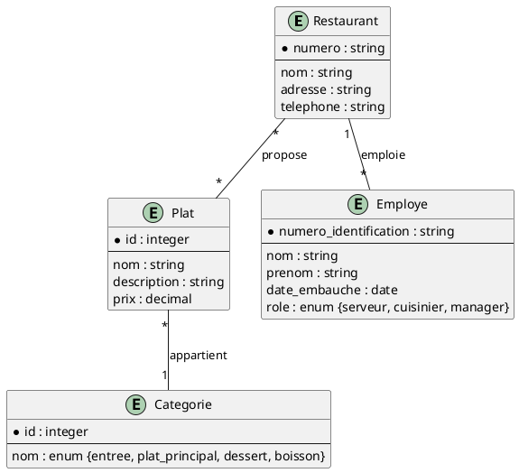
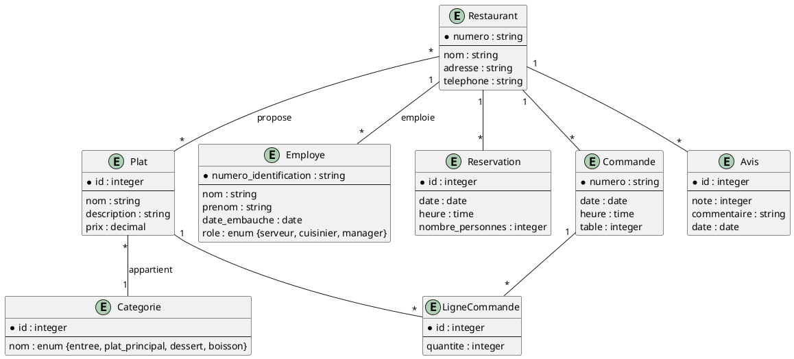
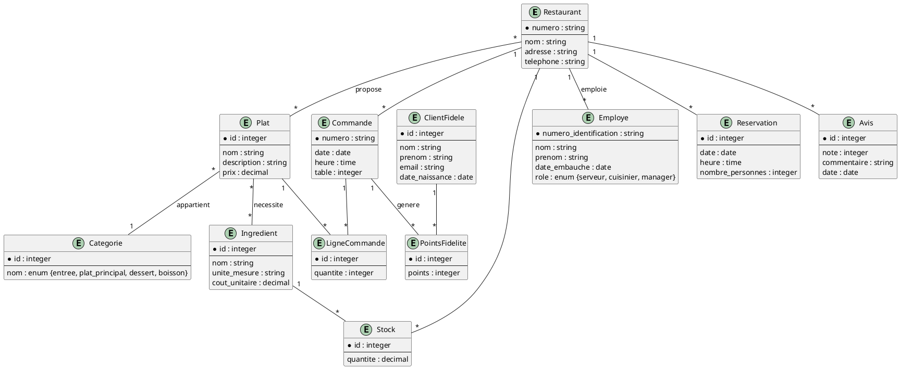
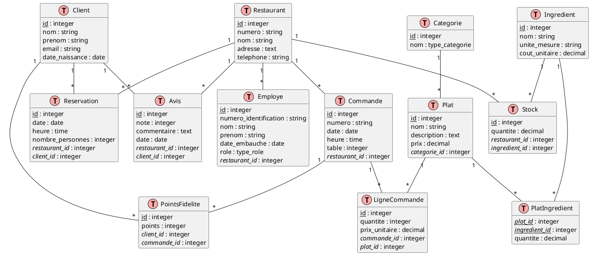

# 4. Chaîne de restaurants

## Modèles logiques

Créez un diagramme EA pour la base de données d'une chaîne de restaurants, basé sur les informations données ci-dessous.

### Partie 1

1. La chaîne possède plusieurs restaurants. Chaque restaurant a un numéro unique, un nom, une adresse et un numéro de
   téléphone.
2. Chaque restaurant propose un menu composé de plusieurs plats. Un plat a un nom, une description et un prix.
3. Les plats sont classés par catégories (entrée, plat principal, dessert, boisson).
4. Chaque restaurant emploie plusieurs employés. Un employé a un numéro d'identification, un nom, un prénom et une date
   d'embauche.
5. Les employés peuvent avoir différents rôles : serveur, cuisinier, manager.

<details>
    <summary>Code</summary>
    

</details>
<br>
<details>
   <summary>Diagramme</summary>
   
</details>
<br>

### Partie 2

Ajoutez les éléments suivants au diagramme EA que vous avez obtenu dans la partie précédente.

1. Les clients peuvent faire des réservations. Une réservation comprend une date, une heure, un nombre de personnes et
   est associée à un restaurant spécifique.
2. Les restaurants reçoivent des commandes. Chaque commande est associée à une table, a un numéro unique, une date et
   une heure.
3. Une commande peut contenir plusieurs plats. On veut pouvoir connaître la quantité de chaque plat commandé.
4. Les clients peuvent laisser des avis sur leur expérience au restaurant. Un avis comprend une note (de 1 à 5 étoiles),
   un commentaire et une date.

<details>
    <summary>Code</summary>
    

</details>
<br>
<details>
   <summary>Diagramme</summary>
   
</details>
<br>

### Partie 3

Ajoutez les éléments suivants au diagramme EA que vous avez obtenu dans la partie précédente.

1. La chaîne de restaurants souhaite gérer son inventaire. Chaque plat nécessite plusieurs ingrédients. Un ingrédient a
   un nom, une unité de mesure et un coût unitaire.
2. Chaque restaurant a son propre stock d'ingrédients. On veut pouvoir suivre la quantité de chaque ingrédient
   disponible dans chaque restaurant.
3. La chaîne propose un programme de fidélité. Les clients peuvent s'inscrire au programme en fournissant leur nom,
   prénom, adresse e-mail et date de naissance.
4. Les membres du programme de fidélité accumulent des points pour chaque euro dépensé. Ces points peuvent être échangés
   contre des réductions sur de futures commandes.


<details>
    <summary>Code</summary>
    

</details>
<br>
<details>
   <summary>Diagramme</summary>
   
</details>
<br>

## Modèle physique

<details>
    <summary>Code</summary>
    

</details>
<br>
<details>
   <summary>Diagramme</summary>
   
</details>
<br>

### Création

<details>
    <summary>Code</summary>
    
```sql
-- Création des types enum
CREATE TYPE type_categorie AS ENUM ('entree', 'plat_principal', 'dessert', 'boisson');
CREATE TYPE type_role AS ENUM ('serveur', 'cuisinier', 'manager');

-- Création des tables
CREATE TABLE Restaurant (
    id INTEGER GENERATED BY DEFAULT AS IDENTITY PRIMARY KEY,
    numero VARCHAR(50) UNIQUE NOT NULL,
    nom VARCHAR(100) NOT NULL,
    adresse TEXT NOT NULL,
    telephone VARCHAR(20) NOT NULL
);

CREATE TABLE Categorie (
    id INTEGER GENERATED BY DEFAULT AS IDENTITY PRIMARY KEY,
    nom type_categorie NOT NULL
);

CREATE TABLE Plat (
    id INTEGER GENERATED BY DEFAULT AS IDENTITY PRIMARY KEY,
    nom VARCHAR(100) NOT NULL,
    description TEXT,
    prix DECIMAL(10, 2) NOT NULL,
    categorie_id INTEGER NOT NULL REFERENCES Categorie(id)
);

CREATE TABLE Employe (
    id INTEGER GENERATED BY DEFAULT AS IDENTITY PRIMARY KEY,
    numero_identification VARCHAR(50) UNIQUE NOT NULL,
    nom VARCHAR(100) NOT NULL,
    prenom VARCHAR(100) NOT NULL,
    date_embauche DATE NOT NULL,
    role type_role NOT NULL,
    restaurant_id INTEGER NOT NULL REFERENCES Restaurant(id)
);

CREATE TABLE Client (
    id INTEGER GENERATED BY DEFAULT AS IDENTITY PRIMARY KEY,
    nom VARCHAR(100) NOT NULL,
    prenom VARCHAR(100) NOT NULL,
    email VARCHAR(100) UNIQUE NOT NULL,
    date_naissance DATE
);

CREATE TABLE Reservation (
    id INTEGER GENERATED BY DEFAULT AS IDENTITY PRIMARY KEY,
    date DATE NOT NULL,
    heure TIME NOT NULL,
    nombre_personnes INTEGER NOT NULL,
    restaurant_id INTEGER NOT NULL REFERENCES Restaurant(id),
    client_id INTEGER NOT NULL REFERENCES Client(id)
);

CREATE TABLE Commande (
    id INTEGER GENERATED BY DEFAULT AS IDENTITY PRIMARY KEY,
    numero VARCHAR(50) UNIQUE NOT NULL,
    date DATE NOT NULL,
    heure TIME NOT NULL,
    table INTEGER NOT NULL,
    restaurant_id INTEGER NOT NULL REFERENCES Restaurant(id)
);

CREATE TABLE LigneCommande (
    id INTEGER GENERATED BY DEFAULT AS IDENTITY PRIMARY KEY,
    quantite INTEGER NOT NULL,
    prix_unitaire DECIMAL(10, 2) NOT NULL,
    commande_id INTEGER NOT NULL REFERENCES Commande(id),
    plat_id INTEGER NOT NULL REFERENCES Plat(id)
);

CREATE TABLE Avis (
    id INTEGER GENERATED BY DEFAULT AS IDENTITY PRIMARY KEY,
    note INTEGER CHECK (note BETWEEN 1 AND 5),
    commentaire TEXT,
    date DATE NOT NULL,
    restaurant_id INTEGER NOT NULL REFERENCES Restaurant(id),
    client_id INTEGER NOT NULL REFERENCES Client(id)
);

CREATE TABLE Ingredient (
    id INTEGER GENERATED BY DEFAULT AS IDENTITY PRIMARY KEY,
    nom VARCHAR(100) NOT NULL,
    unite_mesure VARCHAR(50) NOT NULL,
    cout_unitaire DECIMAL(10, 2) NOT NULL
);

CREATE TABLE PlatIngredient (
    plat_id INTEGER REFERENCES Plat(id),
    ingredient_id INTEGER REFERENCES Ingredient(id),
    quantite DECIMAL(10, 2) NOT NULL,
    PRIMARY KEY (plat_id, ingredient_id)
);

CREATE TABLE Stock (
    id INTEGER GENERATED BY DEFAULT AS IDENTITY PRIMARY KEY,
    quantite DECIMAL(10, 2) NOT NULL,
    restaurant_id INTEGER NOT NULL REFERENCES Restaurant(id),
    ingredient_id INTEGER NOT NULL REFERENCES Ingredient(id)
);

CREATE TABLE PointsFidelite (
    id INTEGER GENERATED BY DEFAULT AS IDENTITY PRIMARY KEY,
    points INTEGER NOT NULL,
    client_id INTEGER NOT NULL REFERENCES Client(id),
    commande_id INTEGER NOT NULL REFERENCES Commande(id)
);
```
</details>
<br>


-------
<small>
   <cite>
      **Note** : Page rédigée en partie avec l'aide d'un assistant IA, principalement
      à l'aide de Perplexity AI, avec les LLM `GPT-4 Omni` et `Claude 3.5 Sonnet`. L'IA
      a été utilisée pour générer des explications, des exemples et/ou des suggestions de
      structure. Toutes les informations ont été vérifiées, éditées et complétées par
      l'auteur.
   </cite>
</small>