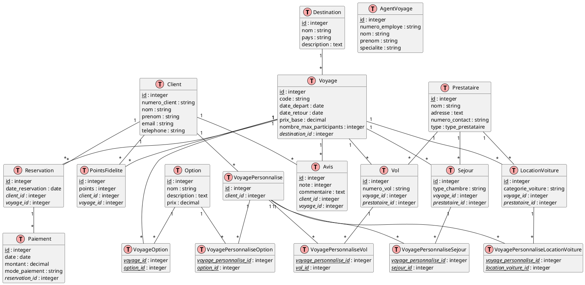

# 5. Agence de voyages

## Modèles logiques

Créez un diagramme EA pour la base de données d'une agence de voyages, basé sur les informations données ci-dessous.

### Partie 1

1. L'agence propose différentes destinations. Chaque destination a un nom, un pays et une description.
2. Les clients de l'agence ont un numéro de client unique, un nom, un prénom, une adresse e-mail et un numéro de
   téléphone.
3. L'agence organise des voyages. Chaque voyage a un code unique, une date de départ, une date de retour et un prix de
   base.
4. Un voyage est associé à une destination et peut accueillir un nombre maximum de participants.
5. Les clients peuvent réserver des voyages. Une réservation concerne un client, un voyage, et a une date de
   réservation.

<details>
    <summary>Code</summary>
    
```sql
@startuml
entity Destination {
  * id : integer
  --
  nom : string
  pays : string
  description : string
}

entity Client {
  * numero_client : string
  --
  nom : string
  prenom : string
  email : string
  telephone : string
}

entity Voyage {
  * code : string
  --
  date_depart : date
  date_retour : date
  prix_base : decimal
  nombre_max_participants : integer
}

entity Reservation {
  * id : integer
  --
  date_reservation : date
}

Voyage "1" -- "1" Destination : concerne
Client "1" -- "*" Reservation
Voyage "1" -- "*" Reservation
@enduml
```
</details>
<br>
<details>
   <summary>Diagramme</summary>
   
</details>
<br>

### Partie 2

Ajoutez les éléments suivants au diagramme EA que vous avez obtenu dans la partie précédente.

1. L'agence travaille avec différents prestataires : compagnies aériennes, hôtels et sociétés de location de voitures.
   Chaque prestataire a un nom, une adresse et un numéro de contact.
2. Un voyage peut inclure des vols, des séjours à l'hôtel et des locations de voiture. Chacun de ces éléments a ses
   propres caractéristiques (numéro de vol, type de chambre, catégorie de voiture, etc.).
3. Les clients peuvent choisir des options supplémentaires pour leur voyage, comme des excursions ou des assurances.
   Chaque option a un nom, une description et un prix.
4. L'agence emploie des agents de voyage. Chaque agent a un numéro d'employé, un nom, un prénom et une spécialité (par
   exemple, voyages d'affaires, croisières, etc.).

<details>
    <summary>Code</summary>
    
```sql
@startuml
entity Destination {
  * id : integer
  --
  nom : string
  pays : string
  description : string
}

entity Client {
  * numero_client : string
  --
  nom : string
  prenom : string
  email : string
  telephone : string
}

entity Voyage {
  * code : string
  --
  date_depart : date
  date_retour : date
  prix_base : decimal
  nombre_max_participants : integer
}

entity Reservation {
  * id : integer
  --
  date_reservation : date
}

Voyage "1" -- "1" Destination : concerne
Client "1" -- "*" Reservation
Voyage "1" -- "*" Reservation

entity Prestataire {
  * id : integer
  --
  nom : string
  adresse : string
  numero_contact : string
  type : enum {compagnie_aerienne, hotel, location_voiture}
}

entity Vol {
  * numero_vol : string
}

entity Sejour {
  * id : integer
  --
  type_chambre : string
}

entity LocationVoiture {
  * id : integer
  --
  categorie_voiture : string
}

entity Option {
  * id : integer
  --
  nom : string
  description : string
  prix : decimal
}

entity AgentVoyage {
  * numero_employe : string
  --
  nom : string
  prenom : string
  specialite : string
}

Voyage "*" -- "*" Prestataire : utilise
Voyage "1" -- "*" Vol
Voyage "1" -- "*" Sejour
Voyage "1" -- "*" LocationVoiture
Voyage "*" -- "*" Option : propose
AgentVoyage "*" -- "*" Voyage : gere
@enduml
```
</details>
<br>
<details>
   <summary>Diagramme</summary>
   
</details>
<br>

### Partie 3

Ajoutez les éléments suivants au diagramme EA que vous avez obtenu dans la partie précédente.

1. L'agence souhaite mettre en place un système d'avis. Les clients peuvent laisser des avis sur les voyages qu'ils ont
   effectués, avec une note (de 1 à 5 étoiles) et un commentaire.
2. L'agence propose un programme de fidélité. Les clients peuvent accumuler des points pour chaque voyage réservé, en
   fonction du prix du voyage. Ces points peuvent être échangés contre des réductions sur de futurs voyages.
3. Certains voyages sont des forfaits tout compris, d'autres sont personnalisables. Pour les voyages personnalisables,
   les clients peuvent choisir individuellement leurs vols, hôtels et activités.
4. L'agence veut suivre les paiements des clients. Un paiement est associé à une réservation, a une date, un montant et
   un mode de paiement (carte de crédit, virement bancaire, etc.).

<details>
    <summary>Code</summary>
    
```sql
@startuml
entity Destination {
  * id : integer
  --
  nom : string
  pays : string
  description : string
}

entity Client {
  * numero_client : string
  --
  nom : string
  prenom : string
  email : string
  telephone : string
}

entity Voyage {
  * code : string
  --
  date_depart : date
  date_retour : date
  prix_base : decimal
  nombre_max_participants : integer
}

entity Reservation {
  * id : integer
  --
  date_reservation : date
}

Voyage "1" -- "1" Destination : concerne
Client "1" -- "*" Reservation
Voyage "1" -- "*" Reservation

entity Prestataire {
  * id : integer
  --
  nom : string
  adresse : string
  numero_contact : string
  type : enum {compagnie_aerienne, hotel, location_voiture}
}

entity Vol {
  * numero_vol : string
}

entity Sejour {
  * id : integer
  --
  type_chambre : string
}

entity LocationVoiture {
  * id : integer
  --
  categorie_voiture : string
}

entity Option {
  * id : integer
  --
  nom : string
  description : string
  prix : decimal
}

entity AgentVoyage {
  * numero_employe : string
  --
  nom : string
  prenom : string
  specialite : string
}

Voyage "*" -- "*" Prestataire : utilise
Voyage "1" -- "*" Vol
Voyage "1" -- "*" Sejour
Voyage "1" -- "*" LocationVoiture
Voyage "*" -- "*" Option : propose
AgentVoyage "*" -- "*" Voyage : gere

entity Avis {
  * id : integer
  --
  note : integer
  commentaire : string
}

entity PointsFidelite {
  * id : integer
  --
  points : integer
}

entity VoyagePersonnalise {
  * id : integer
}

entity Paiement {
  * id : integer
  --
  date : date
  montant : decimal
  mode_paiement : string
}

Client "1" -- "*" Avis
Voyage "1" -- "*" Avis
Client "1" -- "*" PointsFidelite
Voyage "1" -- "*" PointsFidelite : genere
Client "1" -- "*" VoyagePersonnalise
Vol "*" -- "*" VoyagePersonnalise
Sejour "*" -- "*" VoyagePersonnalise
LocationVoiture "*" -- "*" VoyagePersonnalise
Option "*" -- "*" VoyagePersonnalise
Reservation "1" -- "*" Paiement
@enduml
```
</details>
<br>
<details>
   <summary>Diagramme</summary>
   
</details>
<br>

## Modèle physique

<details>
    <summary>Code</summary>
    

</details>
<br>
<details>
   <summary>Diagramme</summary>
   
</details>
<br>

### Création

<details>
    <summary>Code</summary>
    
```sql
-- Création des types enum
CREATE TYPE type_prestataire AS ENUM ('compagnie_aerienne', 'hotel', 'location_voiture');

-- Création des tables
CREATE TABLE Destination (
    id INTEGER GENERATED BY DEFAULT AS IDENTITY PRIMARY KEY,
    nom VARCHAR(100) NOT NULL,
    pays VARCHAR(100) NOT NULL,
    description TEXT
);

CREATE TABLE Client (
    id INTEGER GENERATED BY DEFAULT AS IDENTITY PRIMARY KEY,
    numero_client VARCHAR(50) UNIQUE NOT NULL,
    nom VARCHAR(100) NOT NULL,
    prenom VARCHAR(100) NOT NULL,
    email VARCHAR(100) UNIQUE NOT NULL,
    telephone VARCHAR(20)
);

CREATE TABLE Voyage (
    id INTEGER GENERATED BY DEFAULT AS IDENTITY PRIMARY KEY,
    code VARCHAR(50) UNIQUE NOT NULL,
    date_depart DATE NOT NULL,
    date_retour DATE NOT NULL,
    prix_base DECIMAL(10, 2) NOT NULL,
    nombre_max_participants INTEGER,
    destination_id INTEGER NOT NULL REFERENCES Destination(id)
);

CREATE TABLE Reservation (
    id INTEGER GENERATED BY DEFAULT AS IDENTITY PRIMARY KEY,
    date_reservation DATE NOT NULL,
    client_id INTEGER NOT NULL REFERENCES Client(id),
    voyage_id INTEGER NOT NULL REFERENCES Voyage(id)
);

CREATE TABLE Prestataire (
    id INTEGER GENERATED BY DEFAULT AS IDENTITY PRIMARY KEY,
    nom VARCHAR(100) NOT NULL,
    adresse TEXT,
    numero_contact VARCHAR(20),
    type type_prestataire NOT NULL
);

CREATE TABLE Vol (
    id INTEGER GENERATED BY DEFAULT AS IDENTITY PRIMARY KEY,
    numero_vol VARCHAR(20) NOT NULL,
    voyage_id INTEGER NOT NULL REFERENCES Voyage(id),
    prestataire_id INTEGER NOT NULL REFERENCES Prestataire(id)
);

CREATE TABLE Sejour (
    id INTEGER GENERATED BY DEFAULT AS IDENTITY PRIMARY KEY,
    type_chambre VARCHAR(50) NOT NULL,
    voyage_id INTEGER NOT NULL REFERENCES Voyage(id),
    prestataire_id INTEGER NOT NULL REFERENCES Prestataire(id)
);

CREATE TABLE LocationVoiture (
    id INTEGER GENERATED BY DEFAULT AS IDENTITY PRIMARY KEY,
    categorie_voiture VARCHAR(50) NOT NULL,
    voyage_id INTEGER NOT NULL REFERENCES Voyage(id),
    prestataire_id INTEGER NOT NULL REFERENCES Prestataire(id)
);

CREATE TABLE Option (
    id INTEGER GENERATED BY DEFAULT AS IDENTITY PRIMARY KEY,
    nom VARCHAR(100) NOT NULL,
    description TEXT,
    prix DECIMAL(10, 2) NOT NULL
);

CREATE TABLE VoyageOption (
    voyage_id INTEGER REFERENCES Voyage(id),
    option_id INTEGER REFERENCES Option(id),
    PRIMARY KEY (voyage_id, option_id)
);

CREATE TABLE AgentVoyage (
    id INTEGER GENERATED BY DEFAULT AS IDENTITY PRIMARY KEY,
    numero_employe VARCHAR(50) UNIQUE NOT NULL,
    nom VARCHAR(100) NOT NULL,
    prenom VARCHAR(100) NOT NULL,
    specialite VARCHAR(100)
);

CREATE TABLE Avis (
    id INTEGER GENERATED BY DEFAULT AS IDENTITY PRIMARY KEY,
    note INTEGER CHECK (note BETWEEN 1 AND 5),
    commentaire TEXT,
    client_id INTEGER NOT NULL REFERENCES Client(id),
    voyage_id INTEGER NOT NULL REFERENCES Voyage(id)
);

CREATE TABLE PointsFidelite (
    id INTEGER GENERATED BY DEFAULT AS IDENTITY PRIMARY KEY,
    points INTEGER NOT NULL,
    client_id INTEGER NOT NULL REFERENCES Client(id),
    voyage_id INTEGER NOT NULL REFERENCES Voyage(id)
);

CREATE TABLE VoyagePersonnalise (
    id INTEGER GENERATED BY DEFAULT AS IDENTITY PRIMARY KEY,
    client_id INTEGER NOT NULL REFERENCES Client(id)
);

CREATE TABLE VoyagePersonnaliseVol (
    voyage_personnalise_id INTEGER REFERENCES VoyagePersonnalise(id),
    vol_id INTEGER REFERENCES Vol(id),
    PRIMARY KEY (voyage_personnalise_id, vol_id)
);

CREATE TABLE VoyagePersonnaliseSejour (
    voyage_personnalise_id INTEGER REFERENCES VoyagePersonnalise(id),
    sejour_id INTEGER REFERENCES Sejour(id),
    PRIMARY KEY (voyage_personnalise_id, sejour_id)
);

CREATE TABLE VoyagePersonnaliseLocationVoiture (
    voyage_personnalise_id INTEGER REFERENCES VoyagePersonnalise(id),
    location_voiture_id INTEGER REFERENCES LocationVoiture(id),
    PRIMARY KEY (voyage_personnalise_id, location_voiture_id)
);

CREATE TABLE VoyagePersonnaliseOption (
    voyage_personnalise_id INTEGER REFERENCES VoyagePersonnalise(id),
    option_id INTEGER REFERENCES Option(id),
    PRIMARY KEY (voyage_personnalise_id, option_id)
);

CREATE TABLE Paiement (
    id INTEGER GENERATED BY DEFAULT AS IDENTITY PRIMARY KEY,
    date DATE NOT NULL,
    montant DECIMAL(10, 2) NOT NULL,
    mode_paiement VARCHAR(50) NOT NULL,
    reservation_id INTEGER NOT NULL REFERENCES Reservation(id)
);

CREATE TABLE VoyageOption (
    voyage_id INTEGER REFERENCES Voyage(id),
    option_id INTEGER REFERENCES Option(id),
    PRIMARY KEY (voyage_id, option_id)
);
```
</details>
<br>


-------
<small>
   <cite>
      **Note** : Page rédigée en partie avec l'aide d'un assistant IA, principalement
      à l'aide de Perplexity AI, avec les LLM `GPT-4 Omni` et `Claude 3.5 Sonnet`. L'IA
      a été utilisée pour générer des explications, des exemples et/ou des suggestions de
      structure. Toutes les informations ont été vérifiées, éditées et complétées par
      l'auteur.
   </cite>
</small>