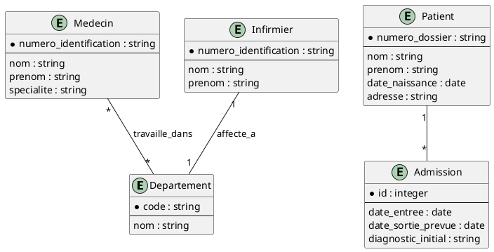
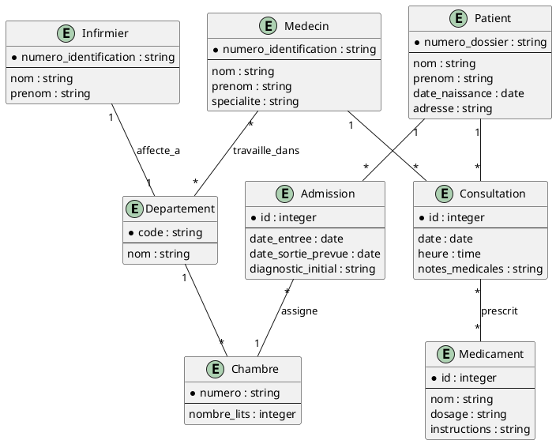
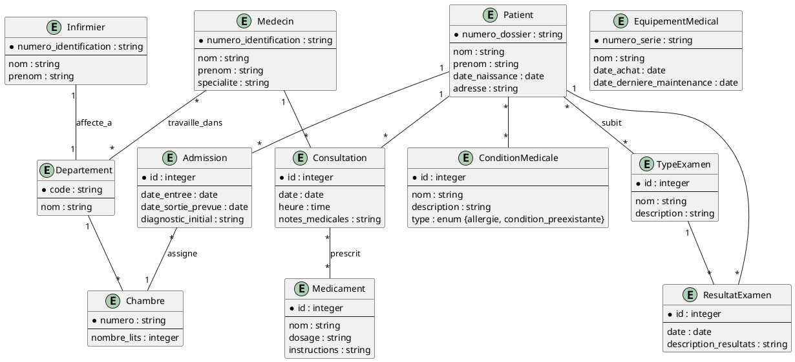
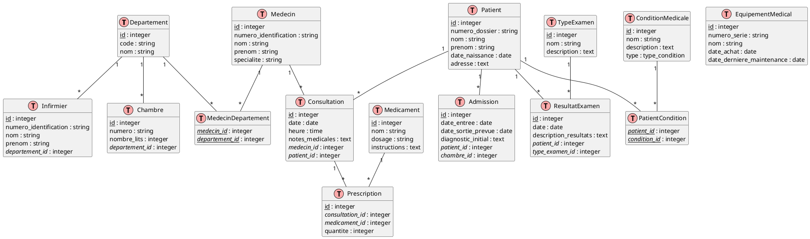

# 6. Système de gestion d'un hôpital

## Modèles logiques

Créez un diagramme EA pour la base de données d'un système de gestion d'hôpital, basé sur les informations données
ci-dessous.

### Partie 1

1. L'hôpital a plusieurs départements (par exemple, urgences, cardiologie, pédiatrie). Chaque département a un nom
   unique et un code.
2. Les patients sont enregistrés avec un numéro de dossier unique, un nom, un prénom, une date de naissance et une
   adresse.
3. Les médecins travaillent dans un ou plusieurs départements. Chaque médecin a un numéro d'identification unique, un
   nom, un prénom et une spécialité.
4. Les infirmiers sont affectés à un département spécifique. Chaque infirmier a un numéro d'identification unique, un
   nom et un prénom.
5. Les patients peuvent être admis à l'hôpital. Une admission a une date d'entrée, une date de sortie prévue et un
   diagnostic initial.

<details>
    <summary>Code</summary>



</details>
<br>
<details>
   <summary>Diagramme</summary>
   
</details>
<br>

### Partie 2

Ajoutez les éléments suivants au diagramme EA que vous avez obtenu dans la partie précédente.

1. L'hôpital dispose de chambres réparties dans différents services. Chaque chambre a un numéro unique et un nombre de
   lits.
2. Lors d'une admission, un patient est assigné à une chambre spécifique.
3. Les médecins effectuent des consultations pour les patients. Une consultation a une date, une heure et des notes
   médicales.
4. Les médicaments prescrits aux patients doivent être enregistrés. Chaque médicament a un nom, un dosage et des
   instructions d'administration.

<details>
    <summary>Code</summary>



</details>
<br>
<details>
   <summary>Diagramme</summary>
   
</details>
<br>

### Partie 3

Ajoutez les éléments suivants au diagramme EA que vous avez obtenu dans la partie précédente.

1. L'hôpital réalise différents types d'examens médicaux (radiographies, analyses de sang, etc.). Chaque type d'examen a
   un nom et une description.
2. Les résultats des examens doivent être enregistrés pour chaque patient. Un résultat d'examen a une date, un type
   d'examen et une description des résultats.
3. L'hôpital gère un inventaire de matériel médical. Chaque équipement a un numéro de série, un nom, une date d'achat et
   une date de dernière maintenance.
4. Les patients peuvent avoir des allergies ou des conditions médicales préexistantes. Ces informations doivent être
   enregistrées dans leur dossier médical.

<details>
    <summary>Code</summary>



</details>
<br>

<details>
   <summary>Diagramme</summary>
   
</details>
<br>

## Modèle physique

<details>
    <summary>Code</summary>



</details>
<br>
<details>
   <summary>Diagramme</summary>
   
</details>
<br>

### Création

<details>
    <summary>Code</summary>

```sql
-- Création des types enum
CREATE TYPE type_condition AS ENUM ('allergie', 'condition_preexistante');

-- Création des tables
CREATE TABLE Departement
(
    id   INTEGER GENERATED BY DEFAULT AS IDENTITY PRIMARY KEY,
    code VARCHAR(10) UNIQUE NOT NULL,
    nom  VARCHAR(100)       NOT NULL
);

CREATE TABLE Patient
(
    id             INTEGER GENERATED BY DEFAULT AS IDENTITY PRIMARY KEY,
    numero_dossier VARCHAR(50) UNIQUE NOT NULL,
    nom            VARCHAR(100)       NOT NULL,
    prenom         VARCHAR(100)       NOT NULL,
    date_naissance DATE               NOT NULL,
    adresse        TEXT
);

CREATE TABLE Medecin
(
    id                    INTEGER GENERATED BY DEFAULT AS IDENTITY PRIMARY KEY,
    numero_identification VARCHAR(50) UNIQUE NOT NULL,
    nom                   VARCHAR(100)       NOT NULL,
    prenom                VARCHAR(100)       NOT NULL,
    specialite            VARCHAR(100)
);

CREATE TABLE Infirmier
(
    id                    INTEGER GENERATED BY DEFAULT AS IDENTITY PRIMARY KEY,
    numero_identification VARCHAR(50) UNIQUE NOT NULL,
    nom                   VARCHAR(100)       NOT NULL,
    prenom                VARCHAR(100)       NOT NULL,
    departement_id        INTEGER            NOT NULL REFERENCES Departement (id)
);

CREATE TABLE Chambre
(
    id             INTEGER GENERATED BY DEFAULT AS IDENTITY PRIMARY KEY,
    numero         VARCHAR(10) UNIQUE NOT NULL,
    nombre_lits    INTEGER            NOT NULL,
    departement_id INTEGER            NOT NULL REFERENCES Departement (id)
);

CREATE TABLE Admission
(
    id                 INTEGER GENERATED BY DEFAULT AS IDENTITY PRIMARY KEY,
    date_entree        DATE    NOT NULL,
    date_sortie_prevue DATE,
    diagnostic_initial TEXT,
    patient_id         INTEGER NOT NULL REFERENCES Patient (id),
    chambre_id         INTEGER NOT NULL REFERENCES Chambre (id)
);

CREATE TABLE Consultation
(
    id              INTEGER GENERATED BY DEFAULT AS IDENTITY PRIMARY KEY,
    date            DATE    NOT NULL,
    heure           TIME    NOT NULL,
    notes_medicales TEXT,
    medecin_id      INTEGER NOT NULL REFERENCES Medecin (id),
    patient_id      INTEGER NOT NULL REFERENCES Patient (id)
);

CREATE TABLE Medicament
(
    id           INTEGER GENERATED BY DEFAULT AS IDENTITY PRIMARY KEY,
    nom          VARCHAR(100) NOT NULL,
    dosage       VARCHAR(50),
    instructions TEXT
);

CREATE TABLE Prescription
(
    id              INTEGER GENERATED BY DEFAULT AS IDENTITY PRIMARY KEY,
    consultation_id INTEGER NOT NULL REFERENCES Consultation (id),
    medicament_id   INTEGER NOT NULL REFERENCES Medicament (id),
    quantite        INTEGER NOT NULL
);

CREATE TABLE TypeExamen
(
    id          INTEGER GENERATED BY DEFAULT AS IDENTITY PRIMARY KEY,
    nom         VARCHAR(100) NOT NULL,
    description TEXT
);

CREATE TABLE ResultatExamen
(
    id                    INTEGER GENERATED BY DEFAULT AS IDENTITY PRIMARY KEY,
    date                  DATE    NOT NULL,
    description_resultats TEXT,
    patient_id            INTEGER NOT NULL REFERENCES Patient (id),
    type_examen_id        INTEGER NOT NULL REFERENCES TypeExamen (id)
);

CREATE TABLE EquipementMedical
(
    id                        INTEGER GENERATED BY DEFAULT AS IDENTITY PRIMARY KEY,
    numero_serie              VARCHAR(50) UNIQUE NOT NULL,
    nom                       VARCHAR(100)       NOT NULL,
    date_achat                DATE               NOT NULL,
    date_derniere_maintenance DATE
);

CREATE TABLE ConditionMedicale
(
    id          INTEGER GENERATED BY DEFAULT AS IDENTITY PRIMARY KEY,
    nom         VARCHAR(100)   NOT NULL,
    description TEXT,
    type        type_condition NOT NULL
);

CREATE TABLE PatientCondition
(
    patient_id   INTEGER REFERENCES Patient (id),
    condition_id INTEGER REFERENCES ConditionMedicale (id),
    PRIMARY KEY (patient_id, condition_id)
);

CREATE TABLE MedecinDepartement
(
    medecin_id     INTEGER REFERENCES Medecin (id),
    departement_id INTEGER REFERENCES Departement (id),
    PRIMARY KEY (medecin_id, departement_id)
);
```

</details>
<br>


-------
<small>
   <cite>
      **Note** : Page rédigée en partie avec l'aide d'un assistant IA, principalement
      à l'aide de Perplexity AI, avec les LLM `GPT-4 Omni` et `Claude 3.5 Sonnet`. L'IA
      a été utilisée pour générer des explications, des exemples et/ou des suggestions de
      structure. Toutes les informations ont été vérifiées, éditées et complétées par
      l'auteur.
   </cite>
</small>