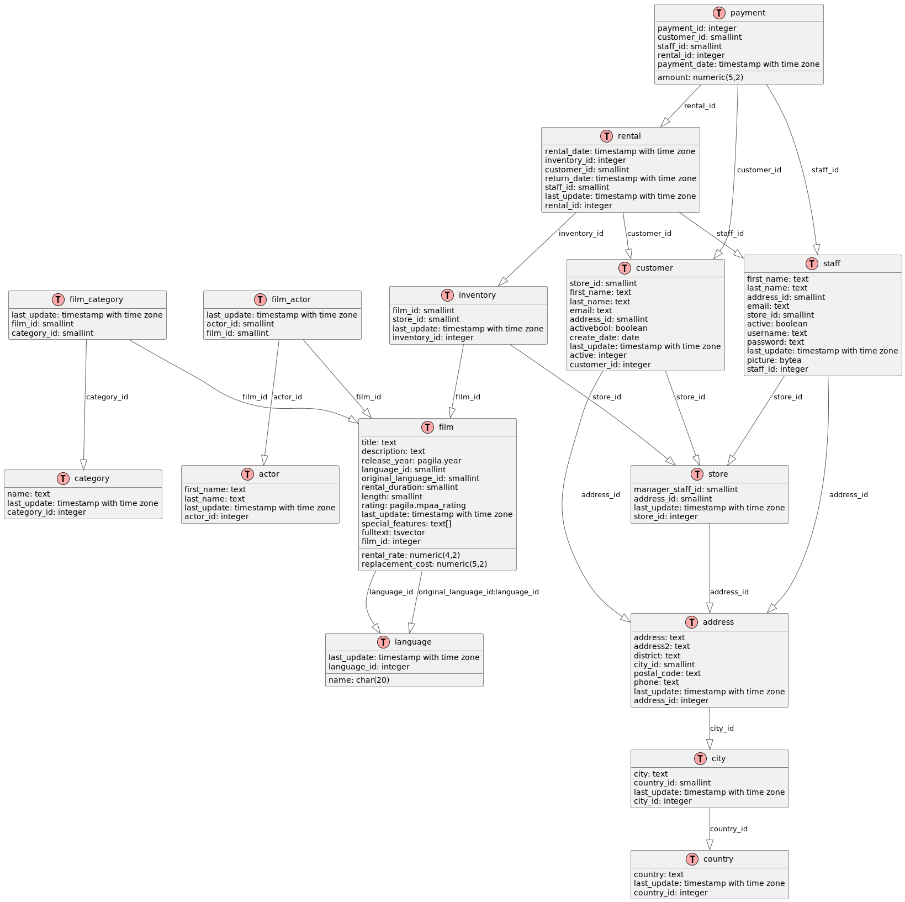

# 1. Pagila Database

## Creation

[pagila_create.sql](../../src/create/pagila_create.sql)

## ERD


??? note "PlantUML"

    ```plantuml
    @startuml
    
    'top to bottom direction
    'skinparam linetype polyline
    !define TABLE(name,desc) class name as "desc" << (T,#FFAAAA) >>
    !define PK(x) <u>x</u>
    !define FK(x) <i>x</i>
    
    hide empty methods
    hide empty fields
    
    TABLE(actor, "actor") {
       first_name: text
       last_name: text
       last_update: timestamp with time zone
       actor_id: integer
    }
    TABLE(address, "address") {
       address: text
       address2: text
       district: text
       city_id: smallint
       postal_code: text
       phone: text
       last_update: timestamp with time zone
       address_id: integer
    }
    TABLE(category, "category") {
       name: text
       last_update: timestamp with time zone
       category_id: integer
    }
    
    TABLE(city, "city") {
       city: text
       country_id: smallint
       last_update: timestamp with time zone
       city_id: integer
    }
    
    TABLE(country, "country") {
       country: text
       last_update: timestamp with time zone
       country_id: integer
    }
    
    TABLE(customer, "customer") {
       store_id: smallint
       first_name: text
       last_name: text
       email: text
       address_id: smallint
       activebool: boolean
       create_date: date
       last_update: timestamp with time zone
       active: integer
       customer_id: integer
    }
    
    TABLE(film, "film") {
       title: text
       description: text
       release_year: pagila.year
       language_id: smallint
       original_language_id: smallint
       rental_duration: smallint
       rental_rate: numeric(4,2)
       length: smallint
       replacement_cost: numeric(5,2)
       rating: pagila.mpaa_rating
       last_update: timestamp with time zone
       special_features: text[]
       fulltext: tsvector
       film_id: integer
    }
    
    TABLE(film_actor, "film_actor") {
       last_update: timestamp with time zone
       actor_id: smallint
       film_id: smallint
    }
    
    TABLE(film_category, "film_category") {
       last_update: timestamp with time zone
       film_id: smallint
       category_id: smallint
    }
    
    TABLE(inventory, "inventory") {
       film_id: smallint
       store_id: smallint
       last_update: timestamp with time zone
       inventory_id: integer
    }
    
    TABLE(language, "language") {
       name: char(20)
       last_update: timestamp with time zone
       language_id: integer
    }
    
    TABLE(payment, "payment") {
       payment_id: integer
       customer_id: smallint
       staff_id: smallint
       rental_id: integer
       amount: numeric(5,2)
       payment_date: timestamp with time zone
    }
    
    TABLE(rental, "rental") {
       rental_date: timestamp with time zone
       inventory_id: integer
       customer_id: smallint
       return_date: timestamp with time zone
       staff_id: smallint
       last_update: timestamp with time zone
       rental_id: integer
    }
    
    TABLE(staff, "staff") {
       first_name: text
       last_name: text
       address_id: smallint
       email: text
       store_id: smallint
       active: boolean
       username: text
       password: text
       last_update: timestamp with time zone
       picture: bytea
       staff_id: integer
    }
    
    TABLE(store, "store") {
       manager_staff_id: smallint
       address_id: smallint
       last_update: timestamp with time zone
       store_id: integer
    }
    
    address        -[#595959,plain]-^  city          : "city_id"
    city           -[#595959,plain]-^  country       : "country_id"
    customer       -[#595959,plain]-^  address       : "address_id"
    customer       -[#595959,plain]-^  store         : "store_id"
    film           -[#595959,plain]-^  language      : "language_id"
    film           -[#595959,plain]-^  language      : "original_language_id:language_id"
    film_actor     -[#595959,plain]-^  actor         : "actor_id"
    film_actor     -[#595959,plain]-^  film          : "film_id"
    film_category  -[#595959,plain]-^  category      : "category_id"
    film_category  -[#595959,plain]-^  film          : "film_id"
    inventory      -[#595959,plain]-^  film          : "film_id"
    inventory      -[#595959,plain]-^  store         : "store_id"
    payment        -[#595959,plain]-^  customer      : "customer_id"
    payment        -[#595959,plain]-^  rental        : "rental_id"
    payment        -[#595959,plain]-^  staff         : "staff_id"
    rental         -[#595959,plain]-^  customer      : "customer_id"
    rental         -[#595959,plain]-^  inventory     : "inventory_id"
    rental         -[#595959,plain]-^  staff         : "staff_id"
    staff          -[#595959,plain]-^  address       : "address_id"
    staff          -[#595959,plain]-^  store         : "store_id"
    store          -[#595959,plain]-^  address       : "address_id"
    @enduml
    ```




## Queries

### 1. Find the films at least 2 hours long

Difficulty: 1

??? note "Answer"

    ```sql
    SELECT title, length
    FROM film
    WHERE length >= 120
    ORDER BY length DESC;
    ```

### 2. Find the ID and description of the film 'ACADEMY DINOSAUR'

Difficulty: 1

??? note "Answer"

    ```sql... SELECT film_id, description
    FROM film
    WHERE title = 'ACADEMY DINOSAUR';
    ```

### 3. Find the categories of 'ACADEMY DINOSAUR'

Difficulty: 2

??? note "Answer"

    ```sql
    SELECT c.name
    FROM category c
             JOIN film_category fc ON c.category_id = fc.category_id
             JOIN film f ON fc.film_id = f.film_id
    WHERE f.title = 'ACADEMY DINOSAUR';
    ```

### 4. Find films without categories

Difficulty: 2

??? note "Answer"

    ```sql
    SELECT f.title
    FROM film f
             LEFT JOIN film_category fc ON f.film_id = fc.film_id
    WHERE fc.category_id IS NULL;
    ```

### 5. Find categories without films

Best answer:

Difficulty: 2

??? note "Answer"

    ```sql
    SELECT c.name
    FROM category c
             LEFT JOIN film_category fc ON c.category_id = fc.category_id
    WHERE fc.film_id IS NULL;
    ```

Other answers:

??? note "Answer"

    ```sql
    select c.category_id, c.name
    from category c
             left join film_category fc on c.category_id = fc.category_id
    group by c.category_id, c.name
    having count(fc.film_id) = 0;
    ```

??? note "Answer"

    ```sql
    select category_id, name
    from category
    where category_id not in (select category_id from film_category);
    ```

??? note "Answer"

    ```sql
    select category_id, name
    from category c
    where not exists(select fc.category_id
                     from film_category fc
                     where fc.category_id = c.category_id);
    ```

??? note "Answer"

    ```sql
    select category_id, name
    from category c
    except
    select c.category_id, c.name
    from category c
             inner join film_category fc on fc.category_id = c.category_id;
    ```

??? note "Answer"

    ```sql
    select c.category_id, name
    from category c
             inner join (select category_id                      
                         from category c
                         except
                         select fc.category_id
                         from film_category fc) as T
                        on c.category_id = T.category_id;
    ```

??? note "Answer"

    ```sql
    with T as (select category_id
               from category c
               except
               select fc.category_id
               from film_category fc)
    select c.category_id, name
    from category c
             inner join T on c.category_id = T.category_id;
    ```

### 6. Find action films

Difficulty: 2

??? note "Answer"

    ```sql
    SELECT f.title
    FROM film f
             JOIN film_category fc ON f.film_id = fc.film_id
             JOIN category c ON fc.category_id = c.category_id
    WHERE c.name = 'Action';
    ```

### 7. Find the number of films in the 'Action' category

Difficulty: 2

??? note "Answer"

    ```sql
    SELECT COUNT(*) AS action_film_count... FROM film_category fc
             JOIN category c
    ON fc.category_id = c.category_id
    WHERE c.name = 'Action';
    ```

### 8. Number of films in each category

Difficulty: 3

??? note "Answer"

    ```sql
    SELECT c.name, COUNT(fc.film_id) AS film_count
    FROM category c
             LEFT JOIN film_category fc ON c.category_id = fc.category_id
    GROUP BY c.category_id, c.name
    ORDER BY film_count DESC;
    ```

### 9. Find the number of categories for each film

Difficulty: 3

??? note "Answer"

    ```sql
    SELECT f.title, COUNT(fc.category_id) AS category_count
    FROM film f
             LEFT JOIN film_category fc ON f.film_id = fc.film_id
    GROUP BY f.film_id, f.title
    ORDER BY category_count DESC;
    ```

### 10. Find the number of films

Difficulty: 1

??? note "Answer"

    ```sql
    SELECT COUNT(*) AS total_films
    FROM film;
    ```

### 11. Find the number of different languages in the language table

Difficulty: 1

??? note "Answer"

    ```sql
    SELECT COUNT(*) AS language_count
    FROM language;
    ```

### 12. Find the number of different languages in the film table

Difficulty: 1

??? note "Answer"

    ```sql
    SELECT COUNT(DISTINCT language_id) AS film_language_count
    FROM film;
    ```

### 13. Category with the largest number of films

Difficulty: 3

??? note "Answer"

    ```sql
    SELECT c.name, COUNT(f.film_id) AS film_count
    FROM category c
             JOIN film_category fc ON c.category_id = fc.category_id
             JOIN film f ON fc.film_id = f.film_id
    GROUP BY c.category_id, c.name
    ORDER BY film_count DESC
    LIMIT 1;
    ```

Difficulty: 4

??? note "Answer"

    ```sql
    WITH category_counts AS (SELECT c.category_id,
                                    c.name,
                                    COUNT(f.film_id) AS film_count
                             FROM category c
                                      JOIN film_category fc
                                           ON c.category_id = fc.category_id
                                      JOIN film f ON fc.film_id = f.film_id
                             GROUP BY c.category_id, c.name),
         max_count AS (SELECT MAX(film_count) AS max_film_count
                       FROM category_counts)
    SELECT cc.name AS category, cc.film_count
    FROM category_counts cc,
         max_count mc
    WHERE cc.film_count = mc.max_film_count
    ORDER BY cc.name;
    ```

### 14. List of most rented films

Difficulty: 3

To get the list of the 10 most rented films, with their title and number of rentals:

??? note "Answer"

    ```sql
    SELECT f.title, COUNT(r.rental_id) AS rental_count
    FROM film f
             JOIN inventory i ON f.film_id = i.film_id
             JOIN rental r ON i.inventory_id = r.inventory_id
    GROUP BY f.film_id, f.title
    ORDER BY rental_count DESC
    LIMIT 10;
    ```

Difficulty: 4

??? note "Answer"

    ```sql
    WITH actor_counts AS (SELECT a.actor_id, a.first_name, a.last_name, COUNT(fa.film_id) AS film_count
                          FROM actor a
                                   JOIN film_actor fa ON a.actor_id = fa.actor_id
                          GROUP BY a.actor_id, a.first_name, a.last_name),
         top_5_count AS (SELECT film_count
                         FROM actor_counts
                         ORDER BY film_count DESC
                         LIMIT 1 OFFSET 4)
    SELECT ac.first_name, ac.last_name, ac.film_count
    FROM actor_counts ac,
         top_5_count t5c
    WHERE ac.film_count >= t5c.film_count
    ORDER BY ac.film_count DESC, ac.last_name, ac.first_name;
    ```

### 15. Total revenue by film category

Difficulty: 3

To calculate the total revenue generated by each film category:

??? note "Answer"

    ```sql
    SELECT c.name AS category, SUM(p.amount) AS total_revenue
    FROM category c
             JOIN film_category fc ON c.category_id = fc.category_id
             JOIN film f ON fc.film_id = f.film_id
             JOIN inventory i
                  ON f.film_id = i.film_id
             JOIN rental r ON i.inventory_id = r.inventory_id
             JOIN payment p ON r.rental_id = p.rental_id
    GROUP BY c.category_id, c.name
    ORDER BY total_revenue DESC;
    ```

### 16. Customers who spent the most

Difficulty: 3

To get the 10 customers who spent the most, with their name and total amount:

??? note "Answer"

    ```sql
    SELECT c.first_name, c.last_name, SUM(p.amount) AS total_spent
    FROM customer c
             JOIN payment p ON c.customer_id = p.customer_id
    GROUP BY c.customer_id, c.first_name, c.last_name
    ORDER BY total_spent DESC
    LIMIT 10;
    ```

Difficulty: 4

??? note "Answer"

    ```sql
    WITH customer_spending AS (SELECT c.customer_id, c.first_name, c.last_name, SUM(p.amount) AS total_spent
                               FROM customer c
                                        JOIN payment p ON c.customer_id = p.customer_id
                               GROUP BY c.customer_id, c.first_name, c.last_name),
         top_10_spent AS (SELECT total_spent
                          FROM customer_spending
                          ORDER BY total_spent DESC
                          LIMIT 1 OFFSET 9)
    SELECT cs.first_name, cs.last_name, cs.total_spent
    FROM customer_spending cs,
         top_10_spent t10s
    WHERE cs.total_spent >= t10s.total_spent
    ORDER BY cs.total_spent DESC, cs.last_name, cs.first_name;
    ```

### 17. Films available in a specific store

Difficulty: 2

To get the list of films available in store with ID 1:

??? note "Answer"

    ```sql
    SELECT DISTINCT f.title
    FROM film f
             JOIN inventory i ON f.film_id = i.film_id
    WHERE i.store_id = 1
    ORDER BY f.title;
    ```

### 18. Who are the 5 actors who appeared in the most films?

Difficulty: 3

??? note "Answer"

    ```sql
    SELECT a.actor_id, a.first_name, a.last_name, COUNT(fa.film_id) AS film_count
    FROM actor a
             JOIN film_actor fa ON a.actor_id = fa.actor_id
    GROUP BY a.actor_id, a.first_name, a.last_name
    ORDER BY film_count DESC
    LIMIT 5;
    ```

Difficulty: 4

??? note "Answer"

    ```sql
    WITH actor_counts AS (SELECT a.actor_id, a.first_name, a.last_name, COUNT(fa.film_id) AS film_count
                          FROM actor a
                                   JOIN film_actor fa ON a.actor_id = fa.actor_id
                          GROUP BY a.actor_id, a.first_name, a.last_name),
         top_5_count AS (SELECT film_count
                         FROM actor_counts
                         ORDER BY film_count DESC
                         LIMIT 1 OFFSET 4)
    SELECT ac.first_name, ac.last_name, ac.film_count
    FROM actor_counts ac,
         top_5_count t5c
    WHERE ac.film_count >= t5c.film_count
    ORDER BY ac.film_count DESC, ac.last_name, ac.first_name;
    ```

### 19. What is the total revenue generated by each store?

Difficulty: 3

??? note "Answer"

    ```sql
    SELECT s.store_id, s.address_id, SUM(p.amount) AS total_revenue
    FROM store s
             JOIN staff st ON s.store_id = st.store_id
             JOIN payment p ON st.staff_id = p.staff_id
    GROUP BY s.store_id, s.address_id
    ORDER BY total_revenue DESC;
    ```

### 20. What are the 10 most profitable films (based on total payment amount)?

Difficulty: 3

??? note "Answer"

    ```sql
    SELECT f.film_id, f.title, SUM(p.amount) AS total_revenue
    FROM film f
             JOIN inventory i ON f.film_id = i.film_id
             JOIN rental r ON i.inventory_id = r.inventory_id
             JOIN payment p ON r.rental_id = p.rental_id
    GROUP BY f.film_id, f.title
    ORDER BY total_revenue DESC
    LIMIT 10;
    ```

Difficulty: 4

??? note "Answer"

    ```sql
    WITH film_revenue AS (SELECT f.film_id, f.title, SUM(p.amount) AS total_revenue
                          FROM film f
                                   JOIN inventory i ON f.film_id = i.film_id
                                   JOIN rental r ON i.inventory_id = r.inventory_id
                                   JOIN payment p ON r.rental_id = p.rental_id
                          GROUP BY f.film_id, f.title),
         top_10_revenue AS (SELECT total_revenue
                            FROM film_revenue
                            ORDER BY total_revenue DESC
                            LIMIT 1 OFFSET 9)
    SELECT fr.film_id, fr.title, fr.total_revenue
    FROM film_revenue fr,
         top_10_revenue t10r
    WHERE fr.total_revenue >= t10r.total_revenue
    ORDER BY fr.total_revenue DESC, fr.title;
    ```

### 21. What is the average rental duration for each film category?

Difficulty: 4

??? note "Answer"

    ```sql
    SELECT c.name, AVG(EXTRACT(DAY FROM (r.return_date - r.rental_date))) AS avg_rental_duration
    FROM category c
             JOIN film_category fc ON c.category_id = fc.category_id
             JOIN film f ON fc.film_id = f.film_id
             JOIN inventory i ON f.film_id = i.film_id
             JOIN rental r ON i.inventory_id = r.inventory_id
    WHERE r.return_date IS NOT NULL
    GROUP BY c.category_id, c.name
    ORDER BY avg_rental_duration DESC;
    ```

### 22. Which customers have not made a rental in more than 3 months?

Difficulty: 4

??? note "Answer"

    ```sql
    SELECT c.customer_id, c.first_name, c.last_name, MAX(r.rental_date) AS last_rental_date
    FROM customer c
             LEFT JOIN rental r ON c.customer_id = r.customer_id
    GROUP BY c.customer_id, c.first_name, c.last_name
    HAVING MAX(r.rental_date) < CURRENT_DATE - INTERVAL '3 months'
        OR MAX(r.rental_date) IS NULL
    ORDER BY last_rental_date;
    ```

### 23. Which films have never been rented?

Difficulty: 3

??? note "Answer"

    ```sql
    SELECT f.film_id, f.title
    FROM film f
             LEFT JOIN inventory i ON f.film_id = i.film_id
             LEFT JOIN rental r ON i.inventory_id = r.inventory_id
    WHERE r.rental_id IS NULL;
    ```

### 24. Which customer spent the most money, and how much did they spend?

Difficulty: 3

??? note "Answer"

    ```sql
    SELECT c.customer_id, c.first_name, c.last_name, SUM(p.amount) AS total_spent
    FROM customer c
             JOIN payment p ON c.customer_id = p.customer_id
    GROUP BY c.customer_id, c.first_name, c.last_name
    ORDER BY total_spent DESC
    LIMIT 1;
    ```

Difficulty: 4

??? note "Answer"

    ```sql
    WITH customer_spending AS (SELECT c.customer_id, c.first_name, c.last_name, SUM(p.amount) AS total_spent
                               FROM customer c
                                        JOIN payment p ON c.customer_id = p.customer_id
                               GROUP BY c.customer_id, c.first_name, c.last_name),
         max_spending AS (SELECT MAX(total_spent) AS max_amount
                          FROM customer_spending)
    SELECT cs.customer_id, cs.first_name, cs.last_name, cs.total_spent
    FROM customer_spending cs,
         max_spending ms
    WHERE cs.total_spent = ms.max_amount
    ORDER BY cs.last_name, cs.first_name;
    ```

### 25. Which 5 pairs of actors appeared together in the most films?

Difficulty: 5

??? note "Answer"

    ```sql
    SELECT a1.actor_id   AS actor1_id,
           a1.first_name AS actor1_first_name,
           a1.last_name  AS actor1_last_name,
           a2.actor_id   AS actor2_id,
           a2.first_name AS actor2_first_name,
           a2.last_name  AS actor2_last_name,
           COUNT(*)      AS films_together
    FROM film_actor fa1
             JOIN film_actor fa2 ON fa1.film_id = fa2.film_id AND fa1.actor_id < fa2.actor_id
             JOIN actor a1 ON fa1.actor_id = a1.actor_id
             JOIN actor a2 ON fa2.actor_id = a2.actor_id
    GROUP BY a1.actor_id, a1.first_name, a1.last_name, a2.actor_id, a2.first_name, a2.last_name
    ORDER BY films_together DESC
    LIMIT 5;
    ```

??? note "Answer"

    ```sql
    WITH actor_pairs AS (SELECT LEAST(fa1.actor_id, fa2.actor_id)    AS actor1_id,
                                GREATEST(fa1.actor_id, fa2.actor_id) AS actor2_id,
                                COUNT(*)                             AS films_together
                         FROM film_actor fa1
                                  JOIN film_actor fa2 ON fa1.film_id = fa2.film_id AND fa1.actor_id < fa2.actor_id
                         GROUP BY LEAST(fa1.actor_id, fa2.actor_id), GREATEST(fa1.actor_id, fa2.actor_id)),
         top_5_count AS (SELECT films_together
                         FROM actor_pairs
                         ORDER BY films_together DESC
                         LIMIT 1 OFFSET 4)
    SELECT a1.actor_id   AS actor1_id,
           a1.first_name AS actor1_first_name,
           a1.last_name  AS actor1_last_name,
           a2.actor_id   AS actor2_id,
           a2.first_name AS actor2_first_name,
           a2.last_name  AS actor2_last_name,
           ap.films_together
    FROM actor_pairs ap
             JOIN actor a1 ON ap.actor1_id = a1.actor_id
             JOIN actor a2 ON ap.actor2_id = a2.actor_id
             JOIN top_5_count t5c ON ap.films_together >= t5c.films_together
    ORDER BY ap.films_together DESC, a1.last_name, a1.first_name, a2.last_name, a2.first_name;
    ``` 
