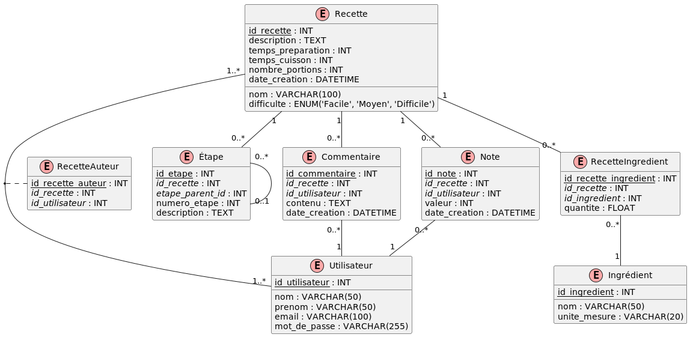

# 2. Cooking Recipes

## Creation

Refer to the file [recettes_create.sql](../../src/create/recettes_create.sql).

## DEA

??? note "PlantUML"

    ```plantuml
    @startuml
    !define TABLE(name,desc) class name as "desc" << (T,#FFAAAA) >>
    !define PK(x) <u>x</u>
    !define FK(x) <i>x</i>
    hide empty methods
    hide empty fields
    
    TABLE(Recette, "Recette") {
        PK(id_recette) : INT
        nom : VARCHAR(100)
        description : TEXT
        temps_preparation : INT
        temps_cuisson : INT
        difficulte : ENUM('Facile', 'Moyen', 'Difficile')
        nombre_portions : INT
        date_creation : DATETIME
    }
    
    TABLE(Utilisateur, "Utilisateur") {
        PK(id_utilisateur) : INT
        nom : VARCHAR(50)
        prenom : VARCHAR(50)
        email : VARCHAR(100)
        mot_de_passe : VARCHAR(255)
    }
    
    TABLE(Ingredient, "Ingrédient") {
        PK(id_ingredient) : INT
        nom : VARCHAR(50)
        unite_mesure : VARCHAR(20)
    }
    
    TABLE(Etape, "Étape") {
        PK(id_etape) : INT
        FK(id_recette) : INT
        FK(etape_parent_id) : INT
        numero_etape : INT
        description : TEXT
    }
    
    TABLE(Commentaire, "Commentaire") {
        PK(id_commentaire) : INT
        FK(id_recette) : INT
        FK(id_utilisateur) : INT
        contenu : TEXT
        date_creation : DATETIME
    }
    
    TABLE(Note, "Note") {
        PK(id_note) : INT
        FK(id_recette) : INT
        FK(id_utilisateur) : INT
        valeur : INT
        date_creation : DATETIME
    }
    
    TABLE(RecetteIngredient, "RecetteIngredient") {
        PK(id_recette_ingredient) : INT
        FK(id_recette) : INT
        FK(id_ingredient) : INT
        quantite : FLOAT
    }
    
    TABLE(RecetteAuteur, "RecetteAuteur") {
        PK(id_recette_auteur) : INT
        FK(id_recette) : INT
        FK(id_utilisateur) : INT
    }
    
    Recette "1" -- "0..*" Etape
    Recette "1" -- "0..*" Commentaire
    Recette "1" -- "0..*" Note
    Recette "1" -- "0..*" RecetteIngredient
    Recette "1..*" -- "1..*" Utilisateur
    (Recette, Utilisateur) .. RecetteAuteur
    RecetteIngredient "0..*" -- "1" Ingredient
    Commentaire "0..*" -- "1" Utilisateur
    Note "0..*" -- "1" Utilisateur
    Etape "0..*" -- "0..1" Etape
    @enduml
    ```



This diagram represents a database structure for a recipe website with the following entities:

1. **Recette (_Recipe_)**: Contains general information about a recipe.
2. **Utilisateur (_User_)**: Represents the website users, who can be recipe authors or leave comments and ratings.
3. **Ingredient**: Lists all possible ingredients.
4. **Etape (_Step_)**: Describes the preparation steps of a recipe.
5. **Commentaire (_Comment_)**: Stores user comments on recipes.
6. **Note (_Rating_)**: Records appreciation ratings given by users to recipes.
7. **RecetteIngredient (_RecipeIngredient_)**: Junction table between Recipe and Ingredient, allowing to specify
   quantities.
8. **RecetteAuteur (_RecipeAuthor_)**: Junction table between Recipe and User, allowing multiple authors per recipe.

## Queries

### 1. Find the recipes requiring less than 30 minutes to prepare.

Difficulty: 1

??? note "Answer"

    ```sql
    SELECT nom, temps_preparation
    FROM Recette
    WHERE temps_preparation < 30
    ORDER BY temps_preparation;
    ```

----------

### 2. List all ingredients whose unit of measurement is in grams (g).

Difficulty: 1

??? note "Answer"

    ```sql
    SELECT nom, unite_mesure
    FROM Ingredient
    WHERE unite_mesure = 'g'
    ORDER BY nom;
    ```

----------

### 3. Display users whose last name begins with 'D'.

Difficulty: 1

??? note "Answer"

    ```sql
    SELECT nom, prenom, email
    FROM Utilisateur
    WHERE nom LIKE 'D%'
    ORDER BY nom, prenom;
    ```

----------

### 4. Find recipes classified as "Difficult".

Difficulty: 1

??? note "Answer"

    ```sql
    SELECT nom, temps_preparation, temps_cuisson
    FROM Recette
    WHERE difficulte = 'Difficile'
    ORDER BY nom;
    ```

----------

### 5. List comments created after January 1, 2024.

Difficulty: 1

??? note "Answer"

    ```sql
    SELECT id_recette, contenu, date_creation
    FROM Commentaire
    WHERE date_creation > '2024-01-01'
    ORDER BY date_creation DESC;
    ```

----------

### 6. Display recipe names with the first and last name of their author.

Difficulty: 2

??? note "Answer"

    ```sql
    SELECT r.nom AS nom_recette, u.prenom, u.nom
    FROM Recette r
             JOIN RecetteAuteur ra ON r.id_recette = ra.id_recette
             JOIN Utilisateur u ON ra.id_utilisateur = u.id_utilisateur
    ORDER BY r.nom;
    ```

----------

### 7. List all ingredients for the "Quiche Lorraine" recipe with their quantities.

Difficulty: 2

??? note "Answer"

    ```sql
    SELECT r.nom AS nom_recette, i.nom AS nom_ingredient, ri.quantite, i.unite_mesure
    FROM Recette r
             JOIN RecetteIngredient ri ON r.id_recette = ri.id_recette
             JOIN Ingredient i ON ri.id_ingredient = i.id_ingredient
    WHERE r.nom = 'Quiche Lorraine'
    ORDER BY i.nom;
    ```

----------

### 8. Display all preparation steps for the "Ratatouille" recipe in order.

Difficulty: 2

??? note "Answer"

    ```sql
    SELECT r.nom AS nom_recette, e.numero_etape, e.description
    FROM Recette r
             JOIN Etape e ON r.id_recette = e.id_recette
    WHERE r.nom = 'Ratatouille'
    ORDER BY e.numero_etape;
    ```

----------

### 9. Find all recipes with their average ratings (if they have any).

Difficulty: 2

??? note "Answer"

    ```sql
    SELECT r.nom AS nom_recette, AVG(n.valeur) AS note_moyenne
    FROM Recette r
             LEFT JOIN Note n ON r.id_recette = n.id_recette
    GROUP BY r.id_recette, r.nom
    ORDER BY note_moyenne DESC NULLS LAST;
    ```

----------

### 10. List all users and the number of recipes they have created (including those who haven't created any).

Difficulty: 2

??? note "Answer"

    ```sql
    SELECT u.prenom, u.nom, COUNT(ra.id_recette) AS nombre_recettes
    FROM Utilisateur u
             LEFT JOIN RecetteAuteur ra ON u.id_utilisateur = ra.id_utilisateur
    GROUP BY u.id_utilisateur, u.prenom, u.nom
    ORDER BY nombre_recettes DESC;
    ```

----------

### 11. Display recipes with their comments, including those without comments.

Difficulty: 2

??? note "Answer"

    ```sql
    SELECT r.nom AS nom_recette, c.contenu AS commentaire
    FROM Recette r
             LEFT JOIN Commentaire c ON r.id_recette = c.id_recette
    ORDER BY r.nom, c.date_creation;
    ```

----------

### 12. Find recipes that use "Flour" and their quantities.

Difficulty: 2

??? note "Answer"

    ```sql
    SELECT r.nom AS nom_recette, ri.quantite, i.unite_mesure
    FROM Recette r
             JOIN RecetteIngredient ri ON r.id_recette = ri.id_recette
             JOIN Ingredient i ON ri.id_ingredient = i.id_ingredient
    WHERE i.nom = 'Farine'
    ORDER BY ri.quantite DESC;
    ```

----------

### 13. List users who have both created recipes and left comments.

Difficulty: 2

??? note "Answer"

    ```sql
    SELECT DISTINCT u.prenom, u.nom
    FROM Utilisateur u
             JOIN RecetteAuteur ra ON u.id_utilisateur = ra.id_utilisateur
             JOIN Commentaire c ON u.id_utilisateur = c.id_utilisateur
    ORDER BY u.nom, u.prenom;
    ```

----------

### 14. Display recipes with their Difficulty and author name, sorted by decreasing Difficulty.

Difficulty: 2

??? note "Answer"

    ```sql
    SELECT r.nom AS nom_recette, r.difficulte, u.prenom, u.nom
    FROM Recette r
             JOIN RecetteAuteur ra ON r.id_recette = ra.id_recette
             JOIN Utilisateur u ON ra.id_utilisateur = u.id_utilisateur
    ORDER BY CASE
                 WHEN r.difficulte = 'Difficile' THEN 1
                 WHEN r.difficulte = 'Moyen' THEN 2
                 WHEN r.difficulte = 'Facile' THEN 3
                 END,
             r.nom;
    ```

----------

### 15. Find recipes that use all the ingredients of a Niçoise salad (assuming these are: Tuna, Olives, Eggs).

Difficulty: 3

??? note "Answer"

    ```sql
    SELECT r.nom AS nom_recette
    FROM Recette r
    WHERE NOT EXISTS (SELECT i.id_ingredient
                      FROM Ingredient i
                      WHERE i.nom IN ('Thon', 'Olive', 'Oeufs')
                        AND NOT EXISTS (SELECT 1
                                        FROM RecetteIngredient ri
                                        WHERE ri.id_recette = r.id_recette
                                          AND ri.id_ingredient = i.id_ingredient))
    ORDER BY r.nom;
    ```

----------

### 16. Calculate the number of recipes for each Difficulty level.

Difficulty: 2

??? note "Answer"

    ```sql
    SELECT difficulte, COUNT(*) AS nombre_recettes
    FROM Recette
    GROUP BY difficulte
    ORDER BY nombre_recettes DESC;
    ```

----------

### 17. Find the average preparation time of recipes for each number of servings.

Difficulty: 2

??? note "Answer"

    ```sql
    SELECT nombre_portions, AVG(temps_preparation) AS temps_moyen_preparation
    FROM Recette
    GROUP BY nombre_portions
    ORDER BY nombre_portions;
    ```

----------

### 18. List the units of measurement used and the number of ingredients for each unit.

Difficulty: 2

??? note "Answer"

    ```sql
    SELECT unite_mesure, COUNT(*) AS nombre_ingredients
    FROM Ingredient
    GROUP BY unite_mesure
    ORDER BY nombre_ingredients DESC;
    ```

----------

### 19. Find the maximum, minimum, and average rating for each recipe.

Difficulty: 2

??? note "Answer"

    ```sql
    SELECT id_recette,
           MAX(valeur) AS note_max,
           MIN(valeur) AS note_min,
           AVG(valeur) AS note_moyenne
    FROM Note
    GROUP BY id_recette
    ORDER BY note_moyenne DESC;
    ```

----------

### 20. Count the number of comments per user.

Difficulty: 2

??? note "Answer"

    ```sql
    SELECT id_utilisateur, COUNT(*) AS nombre_commentaires
    FROM Commentaire
    GROUP BY id_utilisateur
    ORDER BY nombre_commentaires DESC;
    ```

----------

### 21. Display recipe names and the number of ingredients they contain.

Difficulty: 2

??? note "Answer"

    ```sql
    SELECT r.nom AS nom_recette, COUNT(ri.id_ingredient) AS nombre_ingredients
    FROM Recette r
             LEFT JOIN RecetteIngredient ri ON r.id_recette = ri.id_recette
    GROUP BY r.id_recette, r.nom
    ORDER BY nombre_ingredients DESC;
    ```

----------

### 22. Find users who have created the most recipes, with the number of recipes created.

Difficulty: 3

??? note "Answer"

    ```sql
    SELECT u.prenom, u.nom, COUNT(ra.id_recette) AS nombre_recettes
    FROM Utilisateur u
             LEFT JOIN RecetteAuteur ra ON u.id_utilisateur = ra.id_utilisateur
    GROUP BY u.id_utilisateur, u.prenom, u.nom
    ORDER BY nombre_recettes DESC;
    ```

----------

### 23. Calculate the average preparation time of recipes for each author.

Difficulty: 3

??? note "Answer"

    ```sql
    SELECT u.prenom, u.nom, AVG(r.temps_preparation) AS temps_moyen_preparation
    FROM Utilisateur u
             JOIN RecetteAuteur ra ON u.id_utilisateur = ra.id_utilisateur
             JOIN Recette r ON ra.id_recette = r.id_recette
    GROUP BY u.id_utilisateur, u.prenom, u.nom
    ORDER BY temps_moyen_preparation DESC;
    ```

----------

### 24. List the most used ingredients in recipes, with the number of recipes using them.

Difficulty: 3

??? note "Answer"

    ```sql
    SELECT i.nom AS nom_ingredient, COUNT(DISTINCT ri.id_recette) AS nombre_recettes
    FROM Ingredient i
             JOIN RecetteIngredient ri ON i.id_ingredient = ri.id_ingredient
    GROUP BY i.id_ingredient, i.nom
    ORDER BY nombre_recettes DESC
    LIMIT 10;
    ```

----------

### 25. Find the average rating of recipes for each Difficulty level.

Difficulty: 3

??? note "Answer"

    ```sql
    SELECT r.difficulte, AVG(n.valeur) AS note_moyenne
    FROM Recette r
             LEFT JOIN Note n ON r.id_recette = n.id_recette
    GROUP BY r.difficulte
    ORDER BY note_moyenne DESC;
    ```

----------

### 26. Find recipes that have a preparation time above average.

Difficulty: 3

??? note "Answer"

    ```sql
    SELECT nom, temps_preparation
    FROM Recette
    WHERE temps_preparation > (SELECT AVG(temps_preparation)
                               FROM Recette)
    ORDER BY temps_preparation DESC;
    ```

----------

### 27. List users who have created recipes but have never left a comment.

Difficulty: 3

??? note "Answer"

    ```sql
    SELECT DISTINCT u.prenom, u.nom
    FROM Utilisateur u
             JOIN RecetteAuteur ra ON u.id_utilisateur = ra.id_utilisateur
    WHERE u.id_utilisateur NOT IN (SELECT DISTINCT id_utilisateur
                                   FROM Commentaire)
    ORDER BY u.nom, u.prenom;
    ```

----------

### 28. Find recipes that use all the ingredients present in the "Quiche Lorraine" recipe.

Difficulty: 4

??? note "Answer"

    ```sql
    SELECT r.nom
    FROM Recette r
    WHERE NOT EXISTS (SELECT ri.id_ingredient
                      FROM RecetteIngredient ri
                               JOIN Recette q ON ri.id_recette = q.id_recette
                      WHERE q.nom = 'Quiche Lorraine'
                        AND ri.id_ingredient NOT IN (SELECT id_ingredient
                                                     FROM RecetteIngredient
                                                     WHERE id_recette = r.id_recette))
      AND r.nom != 'Quiche Lorraine'
    ORDER BY r.nom;
    ```

----------

### 29. Display recipes whose average rating is higher than the overall average rating of all recipes.

Difficulty: 3

??? note "Answer"

    ```sql
    SELECT r.nom, AVG(n.valeur) AS note_moyenne
    FROM Recette r
             JOIN Note n ON r.id_recette = n.id_recette
    GROUP BY r.id_recette, r.nom
    HAVING AVG(n.valeur) > (SELECT AVG(valeur)
                            FROM Note)
    ORDER BY note_moyenne DESC;
    ```

----------

### 30. Find users who have commented on all the recipes they created.

Difficulty: 4

??? note "Answer"

    ```sql
    SELECT u.prenom, u.nom
    FROM Utilisateur u
    WHERE NOT EXISTS (SELECT ra.id_recette
                      FROM RecetteAuteur ra
                      WHERE ra.id_utilisateur = u.id_utilisateur
                        AND NOT EXISTS (SELECT c.id_commentaire
                                        FROM Commentaire c
                                        WHERE c.id_recette = ra.id_recette
                                          AND c.id_utilisateur = u.id_utilisateur))
      AND EXISTS (SELECT 1
                  FROM RecetteAuteur ra
                  WHERE ra.id_utilisateur = u.id_utilisateur)
    ORDER BY u.nom, u.prenom;
    ```

----------

### 31. List the 3 most commented recipes with their number of comments.

Difficulty: 3

??? note "Answer"

    ```sql
    WITH CommentCount AS (SELECT id_recette, COUNT(*) AS nb_commentaires
                          FROM Commentaire
                          GROUP BY id_recette)
    SELECT r.nom, cc.nb_commentaires
    FROM Recette r
             JOIN CommentCount cc ON r.id_recette = cc.id_recette
    ORDER BY cc.nb_commentaires DESC
    LIMIT 3;
    ```

----------

### 32. Find users who have created recipes and left comments, with the number of recipes and comments.

Difficulty: 3

??? note "Answer"

    ```sql
    WITH RecetteCount AS (SELECT id_utilisateur, COUNT(*) AS nb_recettes
                          FROM RecetteAuteur
                          GROUP BY id_utilisateur),
         CommentCount AS (SELECT id_utilisateur, COUNT(*) AS nb_commentaires
                          FROM Commentaire
                          GROUP BY id_utilisateur)
    SELECT u.prenom,
           u.nom,
           COALESCE(rc.nb_recettes, 0)     AS nb_recettes,
           COALESCE(cc.nb_commentaires, 0) AS nb_commentaires
    FROM Utilisateur u
             LEFT JOIN RecetteCount rc ON u.id_utilisateur = rc.id_utilisateur
             LEFT JOIN CommentCount cc ON u.id_utilisateur = cc.id_utilisateur
    WHERE rc.nb_recettes > 0
       OR cc.nb_commentaires > 0
    ORDER BY nb_recettes DESC, nb_commentaires DESC;
    ```

----------

### 33. Calculate the total score of each recipe based on its ratings (5 points per rating 5, 4 points per rating 4, etc.) and display the top 5.

Difficulty: 4

??? note "Answer"

    ```sql
    WITH ScoreCalculation AS (SELECT id_recette,
                                     SUM(CASE
                                             WHEN valeur = 5 THEN 5
                                             WHEN valeur = 4 THEN 4
                                             WHEN valeur = 3 THEN 3
                                             WHEN valeur = 2 THEN 2
                                             WHEN valeur = 1 THEN 1
                                             ELSE 0
                                         END) AS score_total
                              FROM Note
                              GROUP BY id_recette)
    SELECT r.nom, sc.score_total
    FROM Recette r
             JOIN ScoreCalculation sc ON r.id_recette = sc.id_recette
    ORDER BY sc.score_total DESC
    LIMIT 5;
    ```

----------

### 34. Find "superusers" who have created at least 2 recipes and left at least 3 comments.

Difficulty: 4

??? note "Answer"

    ```sql
    WITH UserActivity AS (SELECT u.id_utilisateur,
                                 COUNT(DISTINCT ra.id_recette)    AS recettes_creees,
                                 COUNT(DISTINCT c.id_commentaire) AS commentaires_laisses
                          FROM Utilisateur u
                                   LEFT JOIN RecetteAuteur ra ON u.id_utilisateur = ra.id_utilisateur
                                   LEFT JOIN Commentaire c ON u.id_utilisateur = c.id_utilisateur
                          GROUP BY u.id_utilisateur)
    SELECT u.prenom, u.nom, ua.recettes_creees, ua.commentaires_laisses
    FROM Utilisateur u
             JOIN UserActivity ua ON u.id_utilisateur = ua.id_utilisateur
    WHERE ua.recettes_creees >= 2
      AND ua.commentaires_laisses >= 3
    ORDER BY ua.recettes_creees DESC, ua.commentaires_laisses DESC;
    ```

----------

### 35. Create a hierarchy of recipe steps, assuming each step can have sub-steps (using recursive CTE).

Difficulty: 5

??? note "Answer"

    ```sql
    WITH RECURSIVE EtapeHierarchy AS (SELECT id_etape, id_recette, numero_etape, description, etape_parent_id, 0 AS niveau
                                      FROM Etape
                                      WHERE etape_parent_id IS NULL
    
                                      UNION ALL
    
                                      SELECT e.id_etape,
                                             e.id_recette,
                                             e.numero_etape,
                                             e.description,
                                             e.etape_parent_id,
                                             eh.niveau + 1
                                      FROM Etape e
                                               JOIN EtapeHierarchy eh ON e.etape_parent_id = eh.id_etape)
    SELECT r.nom                                                             AS nom_recette,
           REPEAT('  ', niveau) || eh.numero_etape || '. ' || eh.description AS etape_detaillee
    FROM EtapeHierarchy eh
             JOIN Recette r ON eh.id_recette = r.id_recette
    ORDER BY r.nom, eh.id_recette, eh.niveau, eh.numero_etape;
    ```

----------

### 36. List all user names and recipe names in a single column, indicating whether it's a user or a recipe.

Difficulty: 3

??? note "Answer"

    ```sql
    SELECT nom AS nom, 'Utilisateur' AS type
    FROM Utilisateur
    UNION
    SELECT nom, 'Recette' AS type
    FROM Recette
    ORDER BY type, nom;
    ```

----------

### 37. Categorize recipes based on their total preparation time (preparation + cooking).

Difficulty: 3

Using `CASE WHEN`

- `'Quick'`: < 30 minutes
- `'Medium'`: >= 30 and < 60 minutes
- `'Long'`: >= 60 minutes

??? note "Answer"

    ```sql
    SELECT nom,
           temps_preparation + temps_cuisson AS temps_total,
           CASE
               WHEN temps_preparation + temps_cuisson < 30 THEN 'Rapide'
               WHEN temps_preparation + temps_cuisson BETWEEN 30 AND 60 THEN 'Moyen'
               ELSE 'Long'
               END                           AS categorie_temps
    FROM Recette
    ORDER BY temps_total;
    ```

----------

### 38. List each recipe with all its ingredients concatenated into a single string.

Difficulty: 3

Utilisation de `STRING_AGG`.

??? note "Answer"

    ```sql
    SELECT r.nom,
           STRING_AGG(i.nom, ', ' ORDER BY i.nom) AS ingredients
    FROM Recette r
             JOIN RecetteIngredient ri ON r.id_recette = ri.id_recette
             JOIN Ingredient i ON ri.id_ingredient = i.id_ingredient
    GROUP BY r.id_recette, r.nom
    ORDER BY r.nom;
    ```

----------

### 39. Rank recipes by Difficulty and assign them a rank based on their preparation time.

Difficulty: 3

Using _"WINDOW FUNCTIONS"_.

??? note "Answer"

    ```sql
    SELECT nom,
           difficulte,
           temps_preparation,
           RANK() OVER (PARTITION BY difficulte ORDER BY temps_preparation) AS rang_temps_prep
    FROM Recette
    ORDER BY difficulte, rang_temps_prep;
    ```

----------

### 40. For each user, find their highest-rated recipe.

Difficulty: 5

Using`LATERAL JOIN`

??? note "Answer"

```sql
SELECT u.nom AS nom_utilisateur, best_recipe.nom AS meilleure_recette, avg_note
FROM Utilisateur u
         LEFT JOIN LATERAL (
    SELECT ra.id_utilisateur, r.nom, AVG(n.valeur) AS avg_note
    FROM RecetteAuteur ra
             JOIN Recette r ON ra.id_recette = r.id_recette
             LEFT JOIN Note n ON r.id_recette = n.id_recette
    WHERE ra.id_utilisateur = u.id_utilisateur
    GROUP BY ra.id_utilisateur, r.id_recette, r.nom
    ORDER BY avg_note DESC NULLS LAST
    LIMIT 1
    ) AS best_recipe
                   ON true
ORDER BY avg_note DESC NULLS LAST;
```

----------

### 41. Compare the number of recipes created and the number of comments left by each user, including all users.

Difficulty: 4

Using `FULL OUTER JOIN`

??? note "Answer"

    ```sql
    SELECT COALESCE(u1.nom, u2.nom)         AS nom_utilisateur,
           COUNT(DISTINCT ra.id_recette)    AS recettes_creees,
           COUNT(DISTINCT c.id_commentaire) AS commentaires_laisses
    FROM (SELECT id_utilisateur, nom FROM Utilisateur) u1
             FULL OUTER JOIN RecetteAuteur ra ON u1.id_utilisateur = ra.id_utilisateur
             FULL OUTER JOIN (SELECT id_utilisateur, nom FROM Utilisateur) u2 ON u1.id_utilisateur = u2.id_utilisateur
             FULL OUTER JOIN Commentaire c ON u2.id_utilisateur = c.id_utilisateur
    GROUP BY COALESCE(u1.id_utilisateur, u2.id_utilisateur), COALESCE(u1.nom, u2.nom)
    ORDER BY recettes_creees DESC, commentaires_laisses DESC;
    ```

----------

### 42. Count the number of recipes created per month over the past year.

Difficulty: 3

??? note "Answer"

    ```sql
    SELECT DATE_TRUNC('month', date_creation) AS mois,
           COUNT(*)                           AS nombre_recettes
    FROM Recette
    WHERE date_creation >= CURRENT_DATE - INTERVAL '1 year'
    GROUP BY DATE_TRUNC('month', date_creation)
    ORDER BY mois;
    ```

----------

### 43. Calculate the average rating of recipes by season.

Difficulty: 3

??? note "Answer"

    ```sql
    SELECT CASE
               WHEN EXTRACT(MONTH FROM n.date_creation) IN (12, 1, 2) THEN 'Hiver'
               WHEN EXTRACT(MONTH FROM n.date_creation) IN (3, 4, 5) THEN 'Printemps'
               WHEN EXTRACT(MONTH FROM n.date_creation) IN (6, 7, 8) THEN 'Été'
               ELSE 'Automne'
               END       AS saison,
           AVG(n.valeur) AS note_moyenne
    FROM Note n
    GROUP BY CASE
                 WHEN EXTRACT(MONTH FROM n.date_creation) IN (12, 1, 2) THEN 'Hiver'
                 WHEN EXTRACT(MONTH FROM n.date_creation) IN (3, 4, 5) THEN 'Printemps'
                 WHEN EXTRACT(MONTH FROM n.date_creation) IN (6, 7, 8) THEN 'Été'
                 ELSE 'Automne'
                 END
    ORDER BY note_moyenne DESC;
    ```

----------

### 44. Find the day of the week when users leave the most comments.

Difficulty: 3

??? note "Answer"

    ```sql
    SELECT TO_CHAR(date_creation, 'Day') AS jour_semaine,
           COUNT(*)                      AS nombre_commentaires
    FROM Commentaire
    GROUP BY TO_CHAR(date_creation, 'Day'), EXTRACT(DOW FROM date_creation)
    ORDER BY EXTRACT(DOW FROM date_creation);
    ```

----------

### 45. Calculate the average number of recipes created per month for each year.

Difficulty: 4

??? note "Answer"

    ```sql
    SELECT EXTRACT(YEAR FROM date_creation) AS annee,
           AVG(recettes_par_mois)           AS moyenne_recettes_par_mois
    FROM (SELECT DATE_TRUNC('month', date_creation) AS mois,
                 COUNT(*)                           AS recettes_par_mois
          FROM Recette
          GROUP BY DATE_TRUNC('month', date_creation)) AS sous_requete
    GROUP BY EXTRACT(YEAR FROM mois)
    ORDER BY annee;
    ```

----------

### 46. Identify users who have been most active (in terms of comments) during the last 30 days.

Difficulty: 3

??? note "Answer"

    ```sql
    SELECT u.nom,
           u.prenom,
           COUNT(*) AS nombre_commentaires
    FROM Utilisateur u
             JOIN Commentaire c ON u.id_utilisateur = c.id_utilisateur
    WHERE c.date_creation >= CURRENT_DATE - INTERVAL '30 days'
    GROUP BY u.id_utilisateur, u.nom, u.prenom
    ORDER BY nombre_commentaires DESC
    LIMIT 5;
    ```

----------

### 47. Compare the number of recipes created this year versus the previous year, by quarter.

Difficulty: 4

??? note "Answer"

    ```sql
    WITH recettes_par_trimestre AS (SELECT EXTRACT(YEAR FROM date_creation)    AS annee,
                                           EXTRACT(QUARTER FROM date_creation) AS trimestre,
                                           COUNT(*)                            AS nombre_recettes
                                    FROM Recette
                                    WHERE (date_creation >= DATE_TRUNC('year', CURRENT_DATE) - INTERVAL '1 year')
                                    GROUP BY EXTRACT(YEAR FROM date_creation), EXTRACT(QUARTER FROM date_creation))
    SELECT r1.trimestre,
           r1.nombre_recettes AS recettes_annee_precedente,
           r2.nombre_recettes AS recettes_annee_courante
    FROM recettes_par_trimestre r1
             LEFT JOIN recettes_par_trimestre r2
                       ON r1.trimestre = r2.trimestre AND r2.annee = EXTRACT(YEAR FROM CURRENT_DATE)
    WHERE r1.annee = EXTRACT(YEAR FROM CURRENT_DATE) - 1
    ORDER BY r1.trimestre;
    ```

