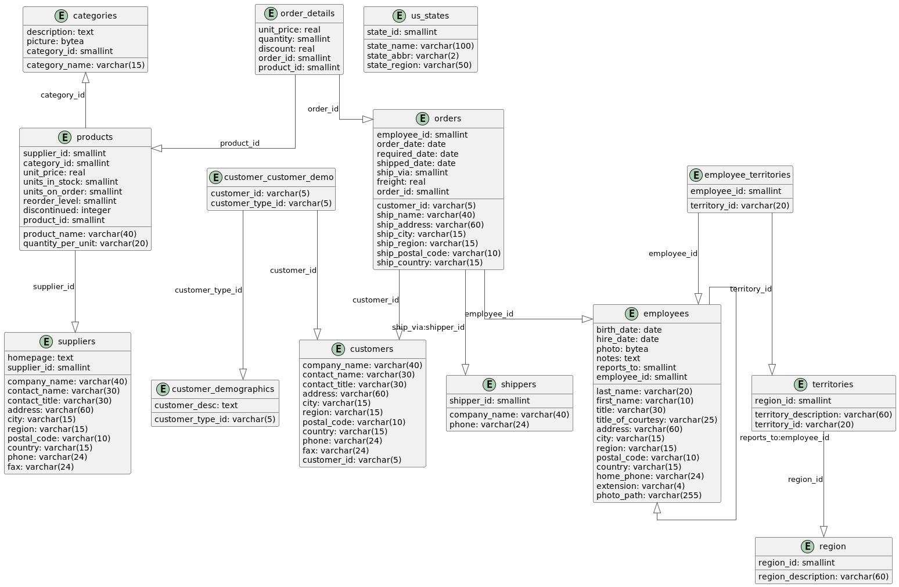

# 3. BD Northwind

## Creation

[northwind_create.sql](../../src/create/northwind_create.sql)

## DEA

??? note "PlantUML"

    ```plantuml
    @startuml
    
    '!theme plain
    top to bottom direction
    skinparam linetype ortho
    skinparam entityFontSize 18
    skinparam entityFontName Source Code Pro
    hide empty methods
    hide empty fields
    
    entity categories {
       category_name: varchar(15)
       description: text
       picture: bytea
       category_id: smallint
    }
    entity customer_customer_demo {
       customer_id: varchar(5)
       customer_type_id: varchar(5)
    }
    entity customer_demographics {
       customer_desc: text
       customer_type_id: varchar(5)
    }
    entity customers {
       company_name: varchar(40)
       contact_name: varchar(30)
       contact_title: varchar(30)
       address: varchar(60)
       city: varchar(15)
       region: varchar(15)
       postal_code: varchar(10)
       country: varchar(15)
       phone: varchar(24)
       fax: varchar(24)
       customer_id: varchar(5)
    }
    entity employee_territories {
       employee_id: smallint
       territory_id: varchar(20)
    }
    entity employees {
       last_name: varchar(20)
       first_name: varchar(10)
       title: varchar(30)
       title_of_courtesy: varchar(25)
       birth_date: date
       hire_date: date
       address: varchar(60)
       city: varchar(15)
       region: varchar(15)
       postal_code: varchar(10)
       country: varchar(15)
       home_phone: varchar(24)
       extension: varchar(4)
       photo: bytea
       notes: text
       reports_to: smallint
       photo_path: varchar(255)
       employee_id: smallint
    }
    entity order_details {
       unit_price: real
       quantity: smallint
       discount: real
       order_id: smallint
       product_id: smallint
    }
    entity orders {
       customer_id: varchar(5)
       employee_id: smallint
       order_date: date
       required_date: date
       shipped_date: date
       ship_via: smallint
       freight: real
       ship_name: varchar(40)
       ship_address: varchar(60)
       ship_city: varchar(15)
       ship_region: varchar(15)
       ship_postal_code: varchar(10)
       ship_country: varchar(15)
       order_id: smallint
    }
    entity products {
       product_name: varchar(40)
       supplier_id: smallint
       category_id: smallint
       quantity_per_unit: varchar(20)
       unit_price: real
       units_in_stock: smallint
       units_on_order: smallint
       reorder_level: smallint
       discontinued: integer
       product_id: smallint
    }
    entity region {
       region_description: varchar(60)
       region_id: smallint
    }
    entity shippers {
       company_name: varchar(40)
       phone: varchar(24)
       shipper_id: smallint
    }
    entity suppliers {
       company_name: varchar(40)
       contact_name: varchar(30)
       contact_title: varchar(30)
       address: varchar(60)
       city: varchar(15)
       region: varchar(15)
       postal_code: varchar(10)
       country: varchar(15)
       phone: varchar(24)
       fax: varchar(24)
       homepage: text
       supplier_id: smallint
    }
    entity territories {
       territory_description: varchar(60)
       region_id: smallint
       territory_id: varchar(20)
    }
    entity us_states {
       state_name: varchar(100)
       state_abbr: varchar(2)
       state_region: varchar(50)
       state_id: smallint
    }
    
    customer_customer_demo  -[#595959,plain]-^  customer_demographics  : "customer_type_id"
    customer_customer_demo  -[#595959,plain]-^  customers              : "customer_id"
    employee_territories    -[#595959,plain]-^  employees              : "employee_id"
    employee_territories    -[#595959,plain]-^  territories            : "territory_id"
    employees               -[#595959,plain]-^  employees              : "reports_to:employee_id"
    order_details           -[#595959,plain]-^  orders                 : "order_id"
    order_details           -[#595959,plain]-^  products               : "product_id"
    orders                  -[#595959,plain]-^  customers              : "customer_id"
    orders                  -[#595959,plain]-^  employees              : "employee_id"
    orders                  -[#595959,plain]-^  shippers               : "ship_via:shipper_id"
    categories              ^-[#595959,plain]-  products               : "category_id"
    products                -[#595959,plain]-^  suppliers              : "supplier_id"
    territories             -[#595959,plain]-^  region                 : "region_id"
    @enduml
    ```





## Queries


### 1. List all products with a unit price greater than 50.

Difficulty: 1

??? note "Answer" 

    ```sql
    SELECT product_name, unit_price
    FROM products
    WHERE unit_price > 50
    ORDER BY unit_price DESC;
    ```


----------

### 2. How many employees are there in total in the company?

Difficulty: 1

??? note "Answer"
    
    ```sql
    SELECT COUNT(*) AS total_employees
    FROM employees;
    ```


----------

### 3. What are the 5 most expensive products?

Difficulty: 1

??? note "Answer"
    
    ```sql
    SELECT product_name, unit_price
    FROM products
    ORDER BY unit_price DESC
    LIMIT 5;
    ```


Difficulty: 3

??? note "Answer"
    
    ```sql
    WITH ranked_products AS (SELECT product_name,
                                    unit_price,
                                    DENSE_RANK() OVER (ORDER BY unit_price DESC) as price_rank
                             FROM products)
    SELECT product_name, unit_price
    FROM ranked_products
    WHERE price_rank <= 5
    ORDER BY unit_price DESC, product_name;
    ```


----------

### 4. List all customers based in France.

Difficulty: 1

??? note "Answer"
    
    ```sql
    SELECT company_name, contact_name, city
    FROM customers
    WHERE country = 'France';
    ```


----------

### 5. What is the average price of products?

Difficulty: 1

??? note "Answer"
    
    ```sql
    SELECT AVG(unit_price) AS average_price
    FROM products;
    ```


----------

### 6. List all suppliers not based in the United States.

Difficulty: 1

??? note "Answer"
    
    ```sql
    SELECT company_name, country
    FROM suppliers
    WHERE country != 'USA';
    ```


----------

### 7. How many products are currently out of stock?

Difficulty: 1

??? note "Answer"
    
    ```sql
    SELECT COUNT(*) AS out_of_stock_products
    FROM products
    WHERE units_in_stock = 0;
    ```


----------

### 8. Which employees were hired after January 1, 1993?

Difficulty: 1

??? note "Answer"
    
    ```sql
    SELECT first_name, last_name, hire_date
    FROM employees
    WHERE hire_date > '1993-01-01'
    ORDER BY hire_date;
    ```


----------

### 9. What is the cheapest product in stock?

Difficulty: 1

??? note "Answer"
    
    ```sql
    SELECT product_name, unit_price
    FROM products
    WHERE units_in_stock > 0
    ORDER BY unit_price ASC
    LIMIT 1;
    ```


Difficulty: 2

??? note "Answer"
    
    ```sql
    SELECT product_name, unit_price
    FROM products
    WHERE units_in_stock > 0
      AND unit_price = (SELECT MIN(unit_price)
                        FROM products
                        WHERE units_in_stock > 0)
    ORDER BY product_name;
    ```


----------

### 10. List all product categories in alphabetical order.

Difficulty: 1

??? note "Answer"
    
    ```sql
    SELECT category_name
    FROM categories
    ORDER BY category_name ASC;
    ```


----------

### 11. List all products with their corresponding category.

Difficulty: 2

??? note "Answer"
    
    ```sql
    SELECT p.product_name, c.category_name
    FROM products p
             JOIN categories c ON p.category_id = c.category_id
    ORDER BY c.category_name, p.product_name;
    ```


----------

### 12. Display employee names and the names of their direct supervisors.

Difficulty: 2

??? note "Answer"
    
    ```sql
    SELECT e.first_name || ' ' || e.last_name AS employee_name,
           m.first_name || ' ' || m.last_name AS manager_name
    FROM employees e
             LEFT JOIN employees m ON e.reports_to = m.employee_id
    ORDER BY manager_name, employee_name;
    ```


----------

### 13. List all customers with their orders, including those who have not yet placed an order.

Difficulty: 2

??? note "Answer"
    
    ```sql
    SELECT c.company_name, o.order_id, o.order_date
    FROM customers c
             LEFT JOIN orders o ON c.customer_id = o.customer_id
    ORDER BY c.company_name, o.order_date;
    ```


----------

### 14. Display the details of products ordered in order number 10248.

Difficulty: 2

??? note "Answer"
    
    ```sql
    SELECT p.product_name, od.quantity, od.unit_price
    FROM order_details od
             JOIN products p ON od.product_id = p.product_id
    WHERE od.order_id = 10248
    ORDER BY p.product_name;
    ```


----------

### 15. List all employees with their assigned territories.

Difficulty: 2

??? note "Answer"
    
    ```sql
    SELECT e.first_name || ' ' || e.last_name AS employee_name,
           t.territory_description
    FROM employees e
             JOIN employee_territories et ON e.employee_id = et.employee_id
             JOIN territories t ON et.territory_id = t.territory_id
    ORDER BY employee_name, t.territory_description;
    ```


----------

### 16. Display supplier names and product names they supply for the 'Beverages' category.

Difficulty: 3

??? note "Answer"
    
    ```sql
    SELECT s.company_name AS supplier_name, p.product_name
    FROM suppliers s
             JOIN products p ON s.supplier_id = p.supplier_id
             JOIN categories c ON p.category_id = c.category_id
    WHERE c.category_name = 'Beverages'
    ORDER BY s.company_name, p.product_name;
    ```


----------

### 17. List all orders placed by the customer 'QUICK-Stop' in 1997.

Difficulty: 2

??? note "Answer"
    
    ```sql
    SELECT o.order_id, o.order_date, e.first_name || ' ' || e.last_name AS employee_name
    FROM orders o
             JOIN customers c ON o.customer_id = c.customer_id
             JOIN employees e ON o.employee_id = e.employee_id
    WHERE c.company_name = 'QUICK-Stop'
      AND EXTRACT(YEAR FROM o.order_date) = 1997
    ORDER BY o.order_date;
    ```


----------

### 18. Display products and their suppliers for all products that are out of stock.

Difficulty: 2

??? note "Answer"
    
    ```sql
    SELECT p.product_name, s.company_name AS supplier_name, p.units_in_stock
    FROM products p
             JOIN suppliers s ON p.supplier_id = s.supplier_id
    WHERE p.units_in_stock = 0
    ORDER BY s.company_name, p.product_name;
    ```


----------

### 19. List all employees and the number of territories assigned to them.

Difficulty: 2

??? note "Answer"
    
    ```sql
    SELECT e.first_name || ' ' || e.last_name AS employee_name,
           COUNT(et.territory_id)             AS territory_count
    FROM employees e
             LEFT JOIN employee_territories et ON e.employee_id = et.employee_id
    GROUP BY e.employee_id, employee_name
    ORDER BY employee_name;
    ```


----------

### 20. Display the details of the most recent order for each customer.

Difficulty: 3

??? note "Answer"
    
    ```sql
    WITH latest_orders AS (SELECT customer_id, MAX(order_date) AS max_order_date
                           FROM orders
                           GROUP BY customer_id)
    SELECT c.company_name, o.order_id, o.order_date
    FROM customers c
             JOIN latest_orders lo ON c.customer_id = lo.customer_id
             JOIN orders o ON lo.customer_id = o.customer_id AND lo.max_order_date = o.order_date
    ORDER BY c.company_name;
    ```


----------

### 21. Calculate the total number of orders per customer.

Difficulty: 2

??? note "Answer"
    
    ```sql
    SELECT c.company_name, COUNT(o.order_id) AS total_orders
    FROM customers c
             LEFT JOIN orders o ON c.customer_id = o.customer_id
    GROUP BY c.customer_id, c.company_name
    ORDER BY total_orders DESC;
    ```


----------

### 22. Find the total revenue by product category.

Difficulty: 3

??? note "Answer"
    
    ```sql
    SELECT c.category_name, TRUNC(SUM(od.quantity * od.unit_price * (1 - od.discount))::numeric, 2) AS total_revenue
    FROM categories c
             JOIN products p ON c.category_id = p.category_id
             JOIN order_details od ON p.product_id = od.product_id
    GROUP BY c.category_id, c.category_name
    ORDER BY total_revenue DESC;
    ```


----------

### 23. List employees and the number of orders they handled in 1997.

Difficulty: 3

??? note "Answer"
    
    ```sql
    SELECT e.first_name || ' ' || e.last_name AS employee_name, COUNT(o.order_id) AS orders_handled
    FROM employees e
             LEFT JOIN orders o ON e.employee_id = o.employee_id AND EXTRACT(YEAR FROM o.order_date) = 1997
    GROUP BY e.employee_id, employee_name
    ORDER BY orders_handled DESC;
    ```


----------

### 24. Calculate the average price of products by supplier.

Difficulty: 2

??? note "Answer"
    
    ```sql
    SELECT s.company_name AS supplier_name, TRUNC(AVG(p.unit_price)::numeric, 2) AS average_price
    FROM suppliers s
             JOIN products p ON s.supplier_id = p.supplier_id
    GROUP BY s.supplier_id, s.company_name
    ORDER BY average_price DESC;
    ```


----------

### 25. Find the 5 best-selling products in terms of quantity.

Difficulty: 2

??? note "Answer"
    
    ```sql
    SELECT p.product_name, SUM(od.quantity) AS total_quantity_sold
    FROM products p
             JOIN order_details od ON p.product_id = od.product_id
    GROUP BY p.product_id, p.product_name
    ORDER BY total_quantity_sold DESC
    LIMIT 5;
    ```


Difficulty: 3

??? note "Answer"
    
    ```sql
    WITH product_sales AS (SELECT p.product_id, p.product_name, SUM(od.quantity) AS total_quantity_sold
                           FROM products p
                                    JOIN order_details od ON p.product_id = od.product_id
                           GROUP BY p.product_id, p.product_name),
         ranked_products AS (SELECT product_id,
                                    product_name,
                                    total_quantity_sold,
                                    DENSE_RANK() OVER (ORDER BY total_quantity_sold DESC) AS sales_rank
                             FROM product_sales)
    SELECT product_id, product_name, total_quantity_sold
    FROM ranked_products
    WHERE sales_rank <= 5
    ORDER BY total_quantity_sold DESC, product_name;
    ```


----------

### 26. Calculate the average number of days between order date and shipping date for each carrier.

Difficulty: 3

??? note "Answer"
    
    ```sql
    SELECT s.company_name                               AS shipper_name,
           ROUND(AVG(o.shipped_date - o.order_date), 2) AS avg_shipping_days
    FROM shippers s
             JOIN orders o ON s.shipper_id = o.ship_via
    WHERE o.shipped_date IS NOT NULL
    GROUP BY s.shipper_id, s.company_name
    ORDER BY avg_shipping_days;
    ```


----------

### 27. Identify customers who have placed orders totaling more than 10000 in value.

Difficulty: 3

??? note "Answer"
    
    ```sql
    SELECT c.company_name,
           TRUNC(SUM(od.quantity * od.unit_price * (1 - od.discount))::numeric, 2) AS total_order_value
    FROM customers c
             JOIN orders o ON c.customer_id = o.customer_id
             JOIN order_details od ON o.order_id = od.order_id
    GROUP BY c.customer_id, c.company_name
    HAVING SUM(od.quantity * od.unit_price * (1 - od.discount)) > 10000
    ORDER BY total_order_value DESC;
    ```


----------

### 28. Calculate the number of different products ordered by each customer.

Difficulty: 3

??? note "Answer"
    
    ```sql
    SELECT c.company_name, COUNT(DISTINCT od.product_id) AS unique_products_ordered
    FROM customers c
             JOIN orders o ON c.customer_id = o.customer_id
             JOIN order_details od ON o.order_id = od.order_id
    GROUP BY c.customer_id, c.company_name
    ORDER BY unique_products_ordered DESC;
    ```


----------

### 29. Find the total revenue by year and month.

Difficulty: 3

??? note "Answer"
    
    ```sql
    SELECT EXTRACT(YEAR FROM o.order_date)                                         AS year,
           EXTRACT(MONTH FROM o.order_date)                                        AS month,
           TRUNC(SUM(od.quantity * od.unit_price * (1 - od.discount))::numeric, 2) AS total_revenue
    FROM orders o
             JOIN order_details od ON o.order_id = od.order_id
    GROUP BY EXTRACT(YEAR FROM o.order_date), EXTRACT(MONTH FROM o.order_date)
    ORDER BY year, month;
    ```


----------

### 30. Identify product categories that have generated the most revenue by region.

Difficulty: 4

??? note "Answer"
    
    ```sql
    SELECT c.category_name,
           r.region_description,
           TRUNC(SUM(od.quantity * od.unit_price * (1 - od.discount))::numeric, 2) AS total_revenue
    FROM categories c
             JOIN products p ON c.category_id = p.category_id
             JOIN order_details od ON p.product_id = od.product_id
             JOIN orders o ON od.order_id = o.order_id
             JOIN customers cu ON o.customer_id = cu.customer_id
             JOIN employees e ON o.employee_id = e.employee_id
             JOIN employee_territories et ON e.employee_id = et.employee_id
             JOIN territories t ON et.territory_id = t.territory_id
             JOIN region r ON t.region_id = r.region_id
    GROUP BY c.category_id, c.category_name, r.region_id, r.region_description
    ORDER BY r.region_description, total_revenue DESC;
    ```


----------

### 31. Find products that have never been ordered.

Difficulty: 2

??? note "Answer"
    
    ```sql
    SELECT p.product_id, p.product_name
    FROM products p
             LEFT JOIN order_details od ON p.product_id = od.product_id
    WHERE od.order_id IS NULL
    ORDER BY p.product_id;
    ```


----------

### 32. Calculate employee ranking based on the number of orders they have handled.

Difficulty: 3

??? note "Answer"
    
    ```sql
    SELECT e.employee_id,
           e.first_name || ' ' || e.last_name            AS employee_name,
           COUNT(o.order_id)                             AS order_count,
           RANK() OVER (ORDER BY COUNT(o.order_id) DESC) AS employee_rank
    FROM employees e
             LEFT JOIN orders o ON e.employee_id = o.employee_id
    GROUP BY e.employee_id, employee_name
    ORDER BY employee_rank, employee_name;
    ```


----------

### 33. Identify customers who have ordered all products in a specific category (for example, 'Beverages').

Difficulty: 4

??? note "Answer"
    
    ```sql
    WITH beverage_products AS (SELECT product_id
                               FROM products
                                        JOIN categories ON products.category_id = categories.category_id
                               WHERE category_name = 'Beverages')
    SELECT c.customer_id, c.company_name
    FROM customers c
    WHERE NOT EXISTS (SELECT bp.product_id
                      FROM beverage_products bp
                      WHERE NOT EXISTS (SELECT 1
                                        FROM orders o
                                                 JOIN order_details od ON o.order_id = od.order_id
                                        WHERE o.customer_id = c.customer_id
                                          AND od.product_id = bp.product_id))
    ORDER BY c.company_name;
    ```


----------

### 34. Calculate the 3-month moving average of total sales.

Difficulty: 4

??? note "Answer"
    
    ```sql
    WITH monthly_sales AS (SELECT DATE_TRUNC('month', o.order_date)                    AS sale_month,
                                  SUM(od.quantity * od.unit_price * (1 - od.discount)) AS total_sales
                           FROM orders o
                                    JOIN
                                order_details od ON o.order_id = od.order_id
                           GROUP BY DATE_TRUNC('month', o.order_date))
    SELECT sale_month,
           total_sales,
           AVG(total_sales) OVER (
               ORDER BY sale_month
               ROWS BETWEEN 2 PRECEDING AND CURRENT ROW
               ) AS moving_average
    FROM monthly_sales
    ORDER BY sale_month;
    ```


----------

### 35. Find pairs of products that are always ordered together.

Difficulty: 5

??? note "Answer"
    
    ```sql
    WITH product_pairs AS (SELECT od1.product_id               AS product1_id,
                                  od2.product_id               AS product2_id,
                                  COUNT(DISTINCT od1.order_id) AS order_count
                           FROM order_details od1
                                    JOIN
                                order_details od2 ON od1.order_id = od2.order_id AND od1.product_id < od2.product_id
                           GROUP BY od1.product_id, od2.product_id)
    SELECT p1.product_name AS product1_name,
           p2.product_name AS product2_name,
           pp.order_count
    FROM product_pairs pp
             JOIN
         products p1 ON pp.product1_id = p1.product_id
             JOIN
         products p2 ON pp.product2_id = p2.product_id
    WHERE pp.order_count = (SELECT COUNT(DISTINCT order_id) FROM orders)
    ORDER BY p1.product_name, p2.product_name;
    ```


----------

### 36. Calculate the percentage contribution of each product to total revenue.

Difficulty: 4

??? note "Answer"
    
    ```sql
    WITH product_sales AS (SELECT p.product_id,
                                  p.product_name,
                                  SUM(od.quantity * od.unit_price * (1 - od.discount)) AS product_revenue
                           FROM products p
                                    JOIN
                                order_details od ON p.product_id = od.product_id
                           GROUP BY p.product_id, p.product_name),
         total_sales AS (SELECT SUM(product_revenue) AS total_revenue
                         FROM product_sales)
    SELECT ps.product_name,
           ps.product_revenue,
           ROUND((ps.product_revenue / ts.total_revenue * 100)::numeric, 2) AS revenue_percentage
    FROM product_sales ps
             CROSS JOIN
         total_sales ts
    ORDER BY revenue_percentage DESC;
    ```


----------

### 37. Identify customers who have increased their purchases from one year to the next.

Difficulty: 4

??? note "Answer"
    
    ```sql
    WITH yearly_customer_purchases AS (SELECT c.customer_id,
                                              c.company_name,
                                              EXTRACT(YEAR FROM o.order_date)                      AS order_year,
                                              SUM(od.quantity * od.unit_price * (1 - od.discount)) AS total_purchase
                                       FROM customers c
                                                JOIN
                                            orders o ON c.customer_id = o.customer_id
                                                JOIN
                                            order_details od ON o.order_id = od.order_id
                                       GROUP BY c.customer_id, c.company_name, EXTRACT(YEAR FROM o.order_date))
    SELECT ycp1.customer_id,
           ycp1.company_name,
           ycp1.order_year                                                                              AS year1,
           ycp1.total_purchase                                                                          AS purchase_year1,
           ycp2.order_year                                                                              AS year2,
           ycp2.total_purchase                                                                          AS purchase_year2,
           TRUNC(((ycp2.total_purchase - ycp1.total_purchase) / ycp1.total_purchase * 100)::numeric, 2) AS growth_percentage
    FROM yearly_customer_purchases ycp1
             JOIN
         yearly_customer_purchases ycp2 ON ycp1.customer_id = ycp2.customer_id AND ycp2.order_year = ycp1.order_year + 1
    WHERE ycp2.total_purchase > ycp1.total_purchase
    ORDER BY growth_percentage DESC;
    ```


----------

### 38. Find the longest sequence of consecutive days with orders.

Difficulty: 4

??? note "Answer"
    
    ```sql
    WITH date_diff AS (SELECT order_date,
                              order_date - LAG(order_date) OVER (ORDER BY order_date) AS diff
                       FROM orders),
         sequences AS (SELECT order_date,
                              SUM(CASE WHEN diff = 1 THEN 0 ELSE 1 END) OVER (ORDER BY order_date) AS seq
                       FROM date_diff)
    SELECT MIN(order_date) AS start_date,
           MAX(order_date) AS end_date,
           COUNT(*)        AS consecutive_days
    FROM sequences
    GROUP BY seq
    ORDER BY consecutive_days DESC
    LIMIT 1;
    ```


Difficulty: 5

??? note "Answer"
    
    ```sql
    WITH date_diff AS (SELECT order_date,
                              order_date - LAG(order_date) OVER (ORDER BY order_date) AS diff
                       FROM orders),
         sequences AS (SELECT order_date,
                              SUM(CASE WHEN diff = 1 THEN 0 ELSE 1 END) OVER (ORDER BY order_date) AS seq
                       FROM date_diff),
         sequence_lengths AS (SELECT seq,
                                     MIN(order_date) AS start_date,
                                     MAX(order_date) AS end_date,
                                     COUNT(*)        AS consecutive_days
                              FROM sequences
                              GROUP BY seq),
         max_length AS (SELECT MAX(consecutive_days) AS max_consecutive_days
                        FROM sequence_lengths)
    SELECT sl.start_date,
           sl.end_date,
           sl.consecutive_days
    FROM sequence_lengths sl
             JOIN
         max_length ml ON sl.consecutive_days = ml.max_consecutive_days
    ORDER BY sl.start_date;
    ```


----------

### 39. Calculate the average time between orders for each customer.

Difficulty: 4

??? note "Answer"
    
    ```sql
    WITH customer_order_dates AS (SELECT customer_id,
                                         order_date,
                                         LAG(order_date) OVER (PARTITION BY customer_id ORDER BY order_date) AS prev_order_date
                                  FROM orders)
    SELECT c.customer_id,
           c.company_name,
           ROUND(AVG(cod.order_date - cod.prev_order_date)::numeric, 2) AS avg_days_between_orders
    FROM customers c
             JOIN
         customer_order_dates cod ON c.customer_id = cod.customer_id
    WHERE cod.prev_order_date IS NOT NULL
    GROUP BY c.customer_id, c.company_name
    ORDER BY avg_days_between_orders;
    ```


----------

### 40. Identify products whose sales have increased each month over a period of at least 3 consecutive months.

Difficulty: 5

??? note "Answer"
    
    ```sql
    WITH monthly_product_sales AS (SELECT p.product_id,
                                          p.product_name,
                                          DATE_TRUNC('month', o.order_date)                    AS sale_month,
                                          SUM(od.quantity * od.unit_price * (1 - od.discount)) AS monthly_sales
                                   FROM products p
                                            JOIN
                                        order_details od ON p.product_id = od.product_id
                                            JOIN
                                        orders o ON od.order_id = o.order_id
                                   GROUP BY p.product_id, p.product_name, DATE_TRUNC('month', o.order_date)),
         sales_growth AS (SELECT product_id,
                                 product_name,
                                 sale_month,
                                 monthly_sales,
                                 LAG(monthly_sales) OVER (PARTITION BY product_id ORDER BY sale_month) AS prev_month_sales,
                                 CASE
                                     WHEN monthly_sales >
                                          LAG(monthly_sales) OVER (PARTITION BY product_id ORDER BY sale_month) THEN 1
                                     ELSE 0
                                     END                                                               AS is_increase
                          FROM monthly_product_sales),
         consecutive_increases AS (SELECT product_id,
                                          product_name,
                                          sale_month,
                                          monthly_sales,
                                          SUM(CASE WHEN is_increase = 0 THEN 1 ELSE 0 END)
                                          OVER (PARTITION BY product_id ORDER BY sale_month) AS grp
                                   FROM sales_growth
                                   WHERE is_increase = 1)
    SELECT DISTINCT product_id,
                    product_name
    FROM (SELECT product_id,
                 product_name,
                 grp,
                 COUNT(*) OVER (PARTITION BY product_id, grp) AS consecutive_count
          FROM consecutive_increases) subq
    WHERE consecutive_count >= 3
    ORDER BY product_id;
    ```


